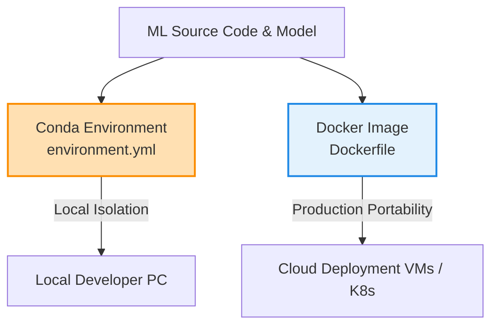

# Assignment 2: Reproducibility with Conda & Docker

The goal of this assignment is to package the non-reproducible codebase from Assignment 1 into a standardized environment using **Conda** for development and **Docker** for distribution.

---

## Architecture & Concept

To achieve complete reproducibility across different virtual environments, two main pillars are implemented:



### 1. Conda Environment Setup
The python packages and base python version are explicitly locked in:
- `requirements.txt`: Tracks exact pip dependency trees.
- `environment.yml`: Allows Conda to reconstruct the identical C-library, Python version (`3.10`), and pip packages in local development.

### 2. Dockerfile & Layer Caching Strategy
The [Dockerfile](file:///c:/Users/pouss/Documents/CSAI/4th%20Year/Spring/DSAI-406-MLOps/Assignments/Assignment-2/Dockerfile) uses **Layer Caching** to avoid downloading packages from scratch on every minor code edit. 

```
[Step 1] FROM python:3.10-slim                   (Base OS / Python layer)
               │
               ▼
[Step 2] COPY requirements.txt .                 (Cache key: requirements file content)
               │
               ▼
[Step 3] RUN pip install -r requirements.txt     (Executes ONLY if requirements.txt changes)
               │
               ▼
[Step 4] COPY . .                                (Copies code changes - runs on every rebuild)
```

By placing `COPY requirements.txt .` and `RUN pip install` *before* copying the rest of the workspace (`COPY . .`), Docker caches the expensive package installation step. If code files change but dependencies stay the same, Docker skips Step 3, completing builds in under a second.
