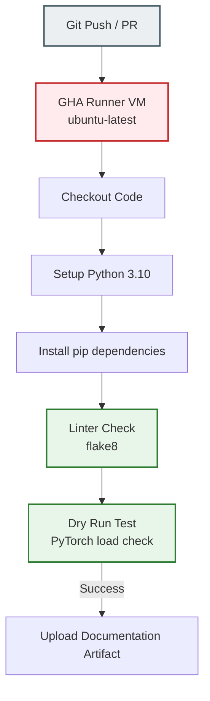

# Assignment 4: Continuous Integration with GitHub Actions

The goal of this assignment is to establish an automated **Continuous Integration (CI)** pipeline using GitHub Actions to audit code changes and prevent regression or broken dependencies from reaching the repository.

---

## Architecture & Concept

Continuous Integration works on a push/pull-request event system. The virtual runner automatically spawns a clean container, runs validations, and posts a success/failure status.

### 1. Runner VMs are Ephemeral
- Every GitHub Actions job executes on a **completely clean virtual machine** starting with an empty disk. 
- Therefore, we must explicitly pull code (`actions/checkout@v4`), setup Python (`actions/setup-python@v5`), and run `pip install` on every trigger. Local system files do not persist between runs.

### 2. Linting (Static Analysis)
- The pipeline executes `flake8 .` to inspect code for syntax errors, undefined variables, and formatting violations before execution.
- If static errors (e.g. `E9` syntax, `F82` undefined name) are discovered, the runner terminates immediately with a non-zero exit code, blocking pull request merges.

### 3. PyTorch Model Dry Test
- Asserts that the base environment imports PyTorch successfully and can instantiate model structures.
- Prevents compilation mismatches from leaking into development or staging environments.
- Logs documentation files (`README.md`) using `upload-artifact@v4` as deployment reference artifacts.
