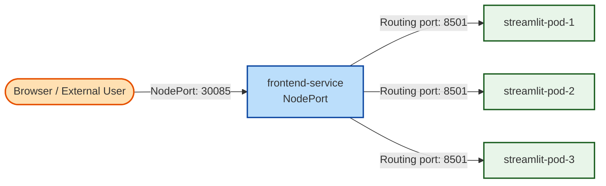

# Assignment 8: Kubernetes Frontend Deployment

## How to run:

1. **Start Minikube cluster:**
   ```bash
   minikube start
   ```

2. **Apply resources:**
   ```bash
   kubectl apply -f deployment.yaml
   ```
   ```bash
   kubectl apply -f service.yaml
   ```

3. **Verify Deployment & Pods status:**
   ```bash
   kubectl get deployments
   kubectl get pods -o wide
   ```

4. **Verify Service access:**
   ```bash
   minikube service frontend-service
   ```

---

## Architecture & Design



### 1. Kubernetes Workload Routing
This setup represents a **Single-Service Kubernetes Architecture**:
- **Workload Deployment**: [deployment.yaml](file:///c:/Users/pouss/Documents/CSAI/4th%20Year/Spring/DSAI-406-MLOps/Assignments/Assignment-8/deployment.yaml) defines the Streamlit frontend. It is scaled to **3 replicas** for high availability. 
- **Resource Constraints**: Each Streamlit pod requests `250m` CPU & `256Mi` memory, limited to `500m` CPU & `512Mi` memory. Exceeding the memory limit will result in Kubernetes killing the pod via OOM (Out Of Memory), while exceeding CPU limits will only result in throttling (slowing down).
- **Service Gateway**: [service.yaml](file:///c:/Users/pouss/Documents/CSAI/4th%20Year/Spring/DSAI-406-MLOps/Assignments/Assignment-8/service.yaml) defines a `NodePort` service. It provides a static entry point that listens on port `80` internally and binds to port `30085` on each minikube cluster node. 
- **Traffic Forwarding**: When a user accesses `http://<Node-IP>:30085`, the NodePort intercepts the request, routes it internally through the Service on port `80`, and load balances the traffic to port `8501` on one of the running pods matching the selector label `app: streamlit-web`.
- **Local Settings (`imagePullPolicy`)**: The deployment has `imagePullPolicy: IfNotPresent` specified to use the image built locally in minikube's Docker registry instead of requesting authentication for a private/remote registry on Docker Hub.
