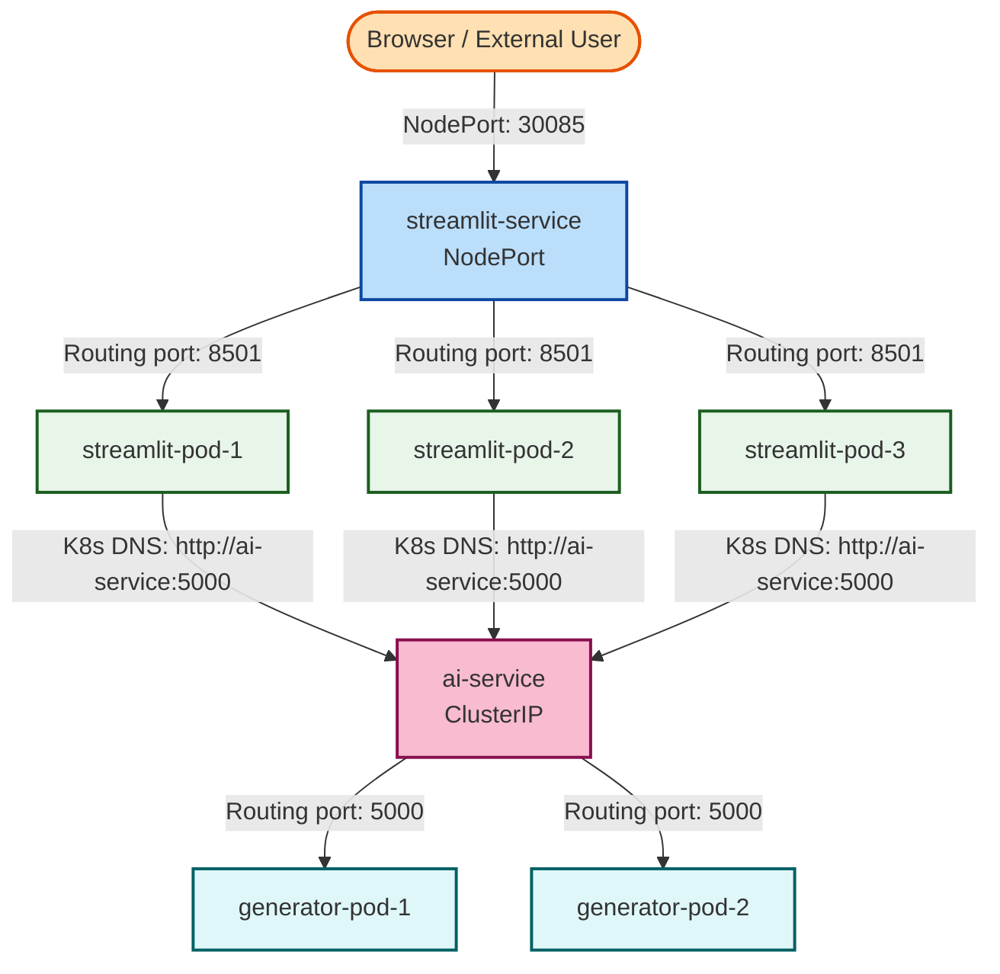

# Assignment 9: Kubernetes Frontend + Backend (Multi-Service)

## How to run:

1. **Start Minikube cluster:**
   ```bash
   minikube start
   ```

2. **Apply resources:**
   - Deploy backend AI model first:
     ```bash
     kubectl apply -f deployment_ai.yaml
     kubectl apply -f service_ai.yaml
     ```
   - Deploy frontend Streamlit application:
     ```bash
     kubectl apply -f deployment_web.yaml
     kubectl apply -f service_web.yaml
     ```

3. **Verify Deployment & Pods status:**
   ```bash
   kubectl get deployments
   kubectl get services
   kubectl get pods -o wide
   ```

4. **Verify Internal Communication:**
   The frontend Streamlit app accesses the backend generator using standard Kubernetes DNS:
   `http://ai-service:5000/predict` (since ClusterIP maps `ai-service` internally).

5. **Expose the Web Frontend to your browser:**
   ```bash
   minikube service streamlit-service
   ```

---

## Architecture & Design



### 1. Multi-Service Microservices Architecture
This setup represents a **Multi-Service Microservices Kubernetes Architecture** isolating the UI layer from the AI inference engine:
- **Frontend Layer**: 
  - Deployments: [deployment_web.yaml](file:///c:/Users/pouss/Documents/CSAI/4th%20Year/Spring/DSAI-406-MLOps/Assignments/Assignment-9/deployment_web.yaml) keeps **3 replicas** of the Streamlit application running.
  - Service: [service_web.yaml](file:///c:/Users/pouss/Documents/CSAI/4th%20Year/Spring/DSAI-406-MLOps/Assignments/Assignment-9/service_web.yaml) exposes the frontend externally using `NodePort` on port `30085`.
- **AI Inference Layer**:
  - Deployments: [deployment_ai.yaml](file:///c:/Users/pouss/Documents/CSAI/4th%20Year/Spring/DSAI-406-MLOps/Assignments/Assignment-9/deployment_ai.yaml) maintains **2 replicas** of the StyleGAN generator inference application.
  - Service: [service_ai.yaml](file:///c:/Users/pouss/Documents/CSAI/4th%20Year/Spring/DSAI-406-MLOps/Assignments/Assignment-9/service_ai.yaml) exposes the backend internally using `ClusterIP` on port `5000`. This isolates the AI pods from external internet traffic for security and cost efficiency.

### 2. Service Discovery & Core DNS
The frontend container talks to the backend via standard **Kubernetes DNS Resolution**. 
- K8s cluster includes an internal CoreDNS resolver mapping the service name `ai-service` to its stable internal Virtual IP `10.96.93.30`. 
- The Streamlit Python code issues requests to `http://ai-service:5000/predict` which resolves internally and load balances to one of the active backend pods.

### 3. Local Image Building & Registry loading
Because the original manifests referenced private or mock remote Docker images (`almond/...:latest`), standard deploys resulted in `ImagePullBackOff`. We resolved this by building local mock services directly inside Minikube:
- **Local build command**:
  ```bash
  minikube image build -t almond/stylegan-inference:latest ./backend
  minikube image build -t almond/streamlit-k8s-demo:latest ./frontend
  ```
- **Manifest adjustments**:
  - `imagePullPolicy: IfNotPresent` was added to both deployment manifests to prevent K8s from trying to pull from Docker Hub.
  - Resource requests for the AI backend were scaled down to **200m CPU / 512Mi Memory** to prevent OOM / scheduling blocks on a single-node local cluster.
