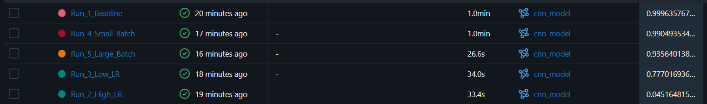
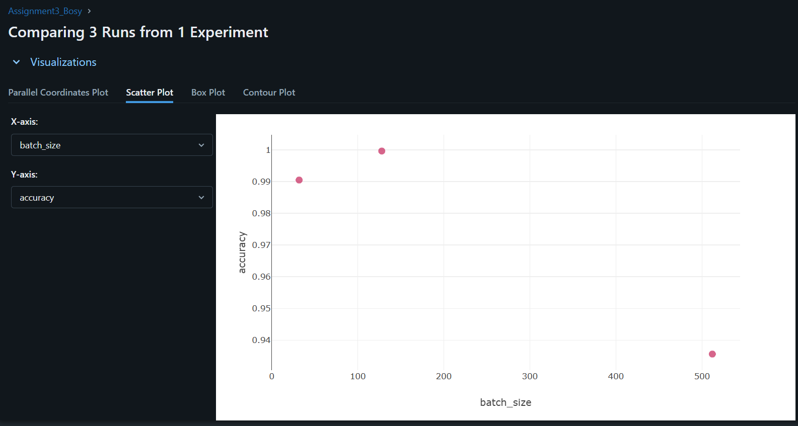
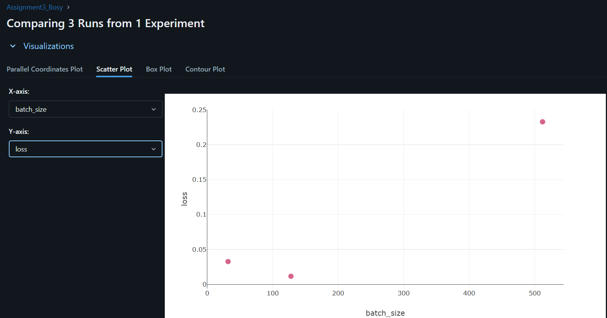
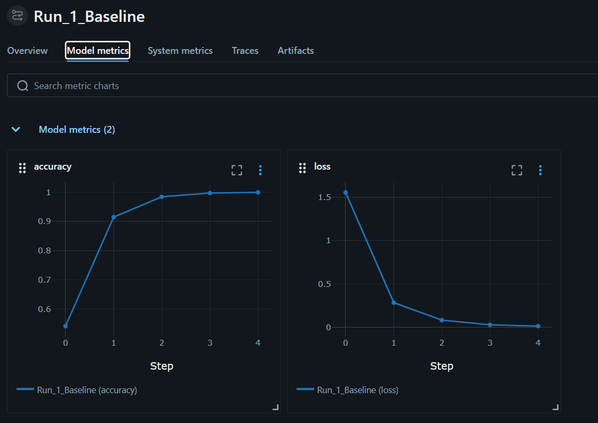
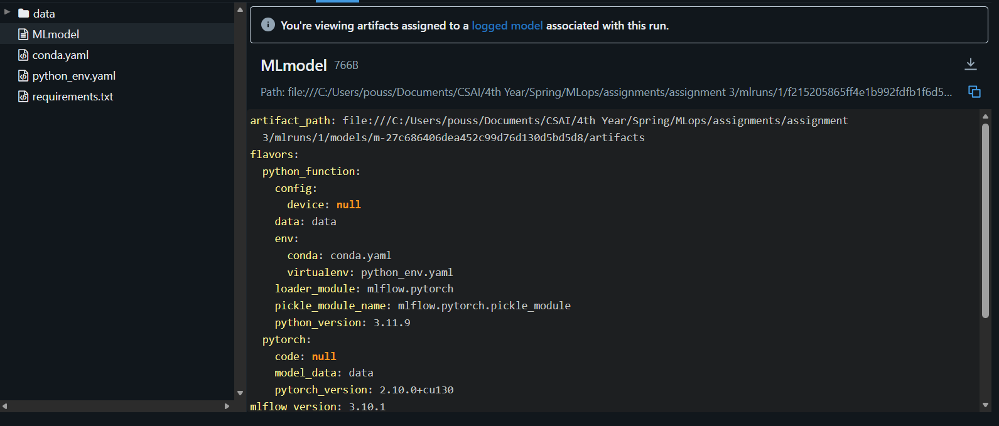
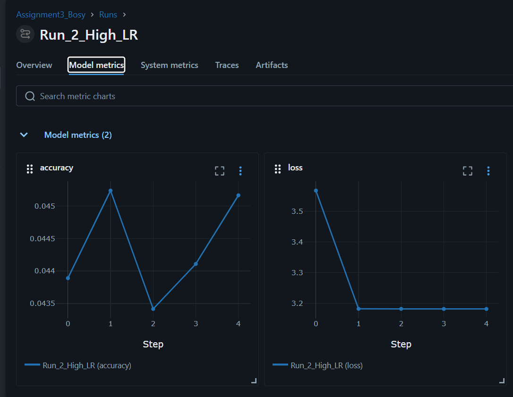
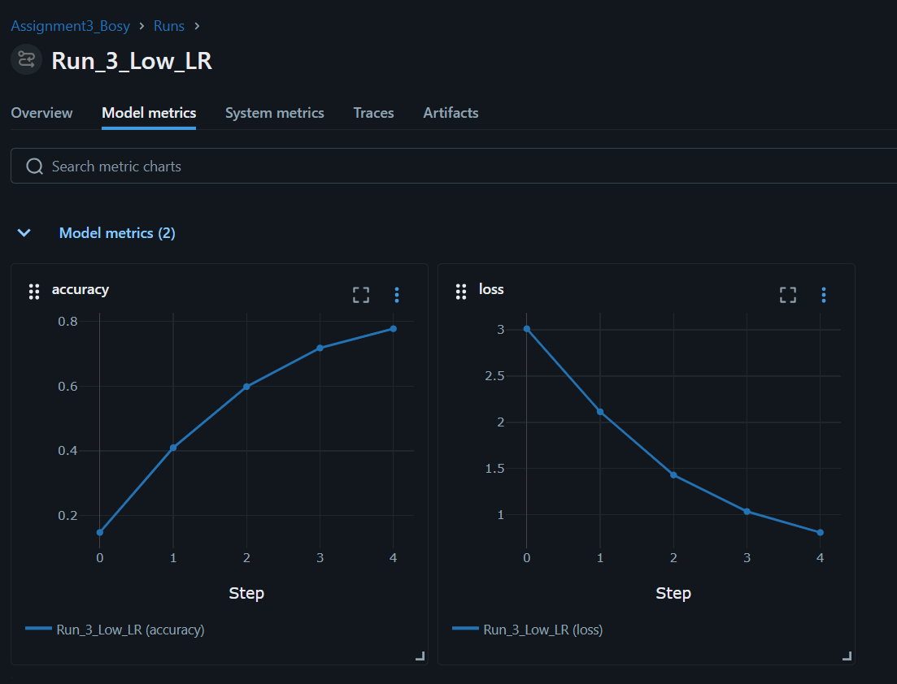
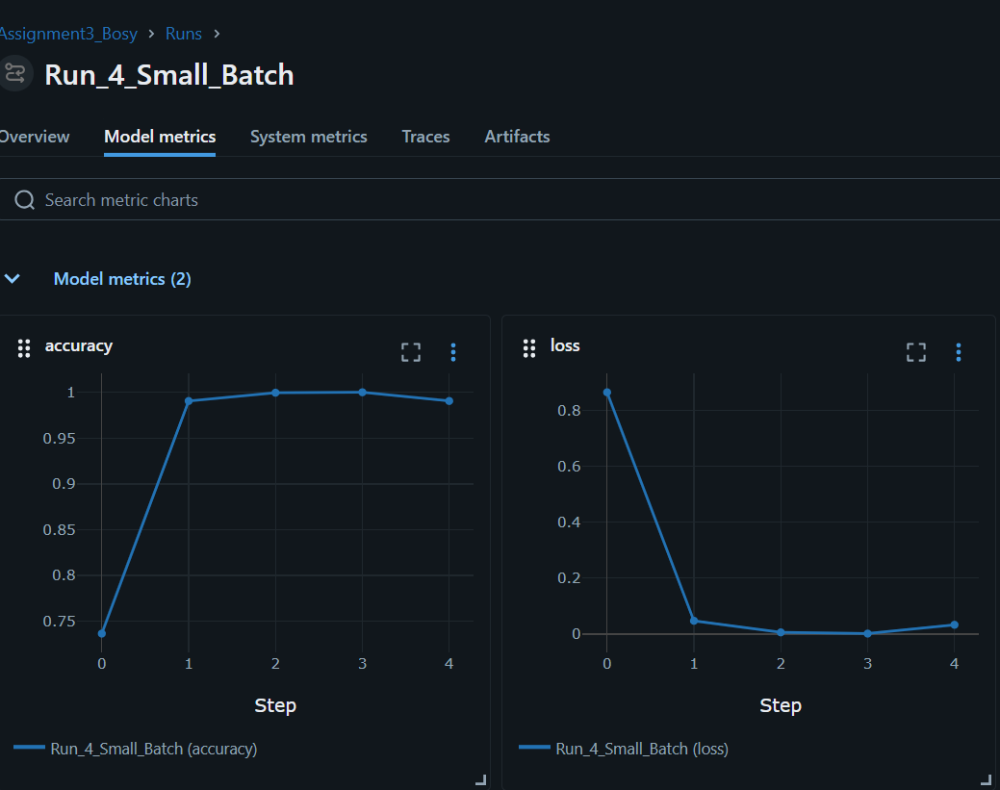
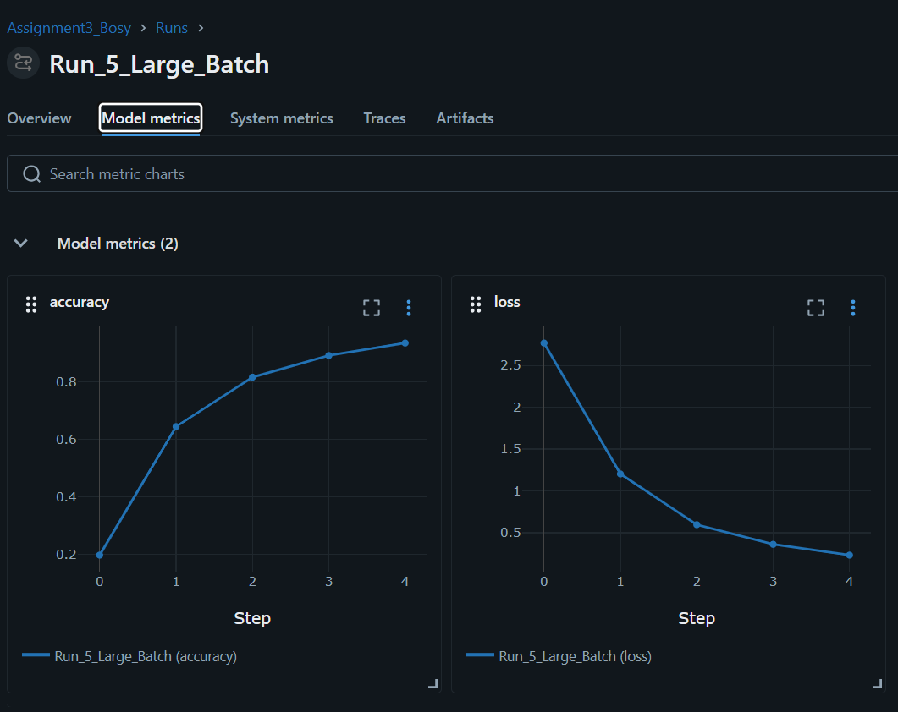

# Assignment 3 Report

## Introduction
The goal of this assignment is to train a model to classify sign language digits using the datamunge/sign-language-mnist dataset. We will use a convolutional neural network (CNN) for this task, and we will evaluate the model's performance using accuracy as the metric.
## Experiment Setup
Dataset used : datamunge/sign-language-mnist
## Results

### Comparing between 3 runs:

### Run 1:

### Run 2:

### Run 3:

### Run 4:

### Run 5:

## Conclusion
### Which run was the "Winner" and why?
The winner is Run 1 (Baseline). Using a learning rate of $0.001$ and a batch size of $128$, it reached an  99.96% accuracy by Epoch 5. The convergence was incredibly smooth, with the loss dropping steadily from $1.55$ to $0.011$.
Run 4 (Small Batch) learned slightly faster, hitting nearly 100% accuracy by Epoch 3, but showed a bit of instability at the very end, making Run 1 the safer and more stable winner.

### Convergence and Stability 

Analysis Stability: The data clearly shows that a high learning rate causes severe instability. Run 2 (High LR: 0.05) completely failed to converge.

Convergence: Batch size heavily impacted convergence speed. Run 4 (Batch 32) converged much faster than Run 5 (Batch 512) because the model weights were updated much more frequently per epoch.

Reproducibility: Run 1

Learning Rate: $0.001$

Batch Size: $128$

Epochs: $5$

### Evidence of Overfitting or Underfitting

Underfitting: There is strong evidence of underfitting in Run 3 (Low LR: 0.0001). Because the learning rate was too small, the model learned far too slowly and only managed to reach 77.7% accuracy by the end of 5 epochs. It would need many more epochs to catch up.

Overfitting / Gradient Noise: In Run 4 (Small Batch), the model hit 100% accuracy at Epoch 4, but at Epoch 5, the accuracy slightly dropped and the loss spiked back up from $0.0013$ to $0.0328$. This "bouncing" is a classic sign of noisy gradients caused by a small batch size, and if left training, it could begin to overfit to the training data