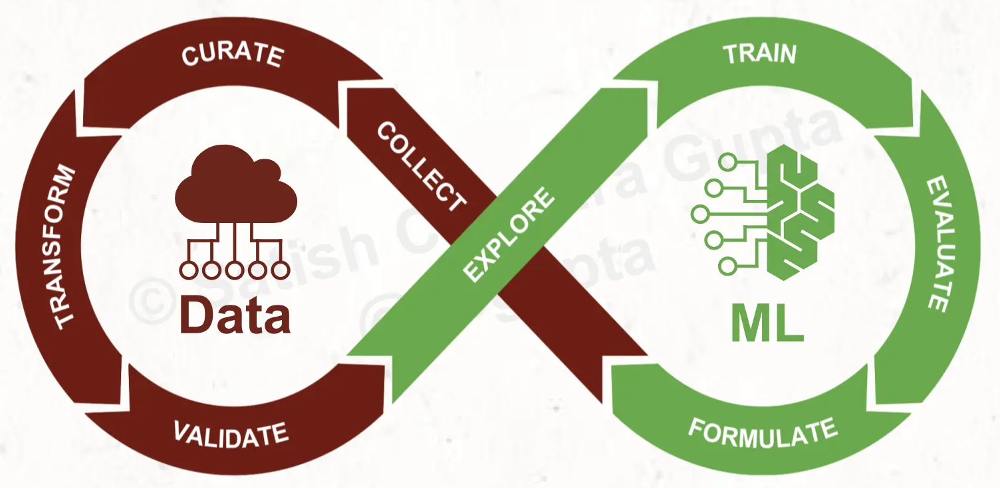
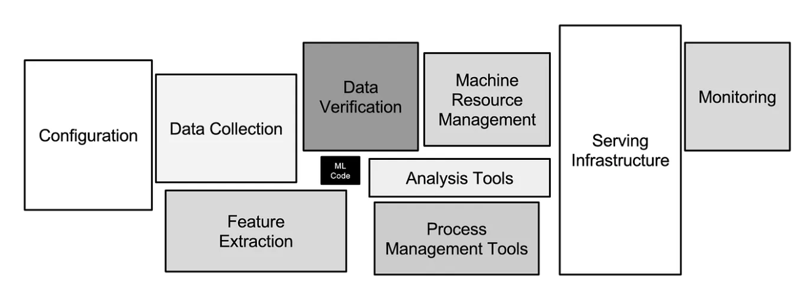
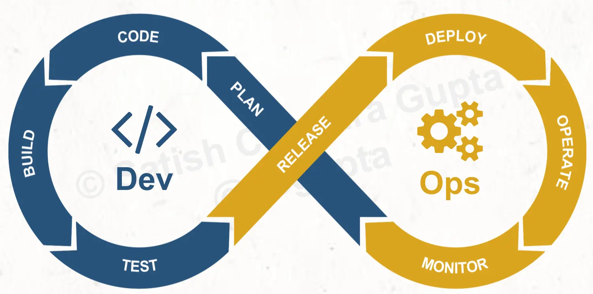
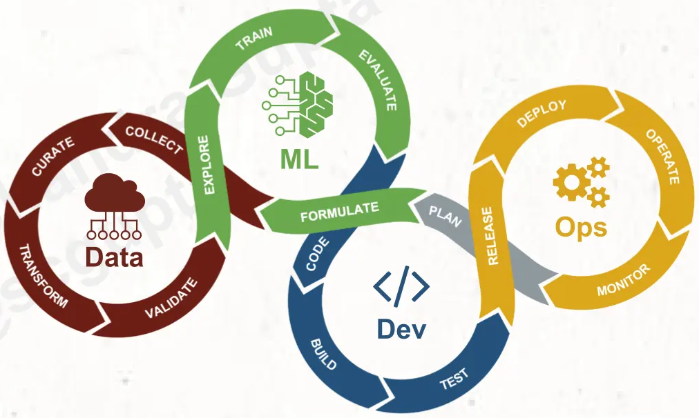

# ML Engineering for Production   (DSAI 406)
## Lecture 1

Mohamed Ghalwash
<Email v="mghalwash@zewailcity.edu.eg" />

---
layout: fact
---

# Recording is NOT allowed 

---
layout: top-title
---

:: title :: 

# Model Development

:: content :: 

- Model Development: _Data (CSV) -> Notebook -> Feature Engineering -> Model training -> Accuracy_

  

<v-click>

- Imagine a scenario with a small change in library version when deploying it into production (Reproducibility)

</v-click>

---
layout: top-title
---

:: title :: 

# Hidden Technical Debt in Machine Learning Systems, NeurIPs (2015)

:: content :: 

ML systems require robust engineering beyond just algorithm development

  

<v-click>

The goal is not to add new functionality, but to enable future improvements, reduce errors, and improve maintainability.

</v-click>

<v-click>

MLOps is about **Automation** + **Shipping**

</v-click>

---
layout: top-title
---

:: title :: 

# What is DevOps?

:: content :: 

- Increase an organization’s velocity in releasing high-quality software
- Speed, reliability, scale, security, continuous integration and delivery, and microservices

  

<v-click>

**Tasks**: 
- Versioning Git (Code) 
- Unit and integration tests 
- Deploying a binary/service

</v-click>

---
layout: top-title-two-cols
---

:: title :: 

# What is DataOps?

:: left :: 

- Periodic collection of data
- Streaming data
- Event-driven data
- Big data jobs
- Data versioning

:: right :: 

<v-click>

**Tasks**: 
- Versioning DVC 
- Data Validation

</v-click>

---
layout: top-title
---

:: title :: 

# What is MLOps?

:: content :: 

- MLOps is the intersection of Machine Learning, DevOps, and Data Engineering

- MLOps as the process of automating machine learning using DevOps methodologies

  

With MLOps, not only do the software engineering processes need full automation, but so do the data and modeling.  The model training and deployment is a new wrinkle added to the traditional DevOps lifecycle.

---
layout: top-title
---

:: title :: 

# What is MLOps?

:: content :: 

Additional monitoring and instrumentation must account for new things that can break, like data drift

**Tasks**: 
- Versioning Git (Code) + DVC (Data) + Model Registry
- Unit and integration tests + Data Validation and Model Quality
- Deploying + Deploying a prediction pipeline instead of just a binary/service
- Models decay (Data Drift)

<!-- 

# What is MLOps Lifecycle?

- Problem Definition
- Data Acquisition and Labelling
- Feature Engineering
- Model Training/Tuning
- Deployment & Monitoring
- The Feedback Loop (Re-training) 
- -->

---
layout: top-title
---

:: title :: 

# What are MLOps Topics?

:: content :: 

- Continuous improvement / integration / delivery
- Cloud Computing 
- AutoML 
- Containers
- Edge Computing 
- Model Portability 

---
layout: center
---

## What is the difference between data scientist and ML Engineer and ML Researcher ?

---
layout: top-title
---

:: title ::

# References

:: content :: 

- Images were taken from [ML4devs](https://www.ml4devs.com/articles/mlops-machine-learning-life-cycle/)
- Research paper "Hidden Technical Debt in Machine Learning Systems, NeurIPs (2015) by Google

---
layout: center
class: text-center
---

# Learn More

[Course Homepage](https://github.com/m-fakhry/DSAI-406-MLOps)

---
layout: top-title
---

:: title ::

# Lessons Learned

:: content :: 

- All assignments should be uploaded to classroom even if it was graded 
- All assignments should be uploaded before the deadline 
- Medical excuses should be submitted within one week of the excused task (assignment, quiz, midterm)
- Contents of the redo tasks will be based on the content up to the date of the task remake not the original content
  
