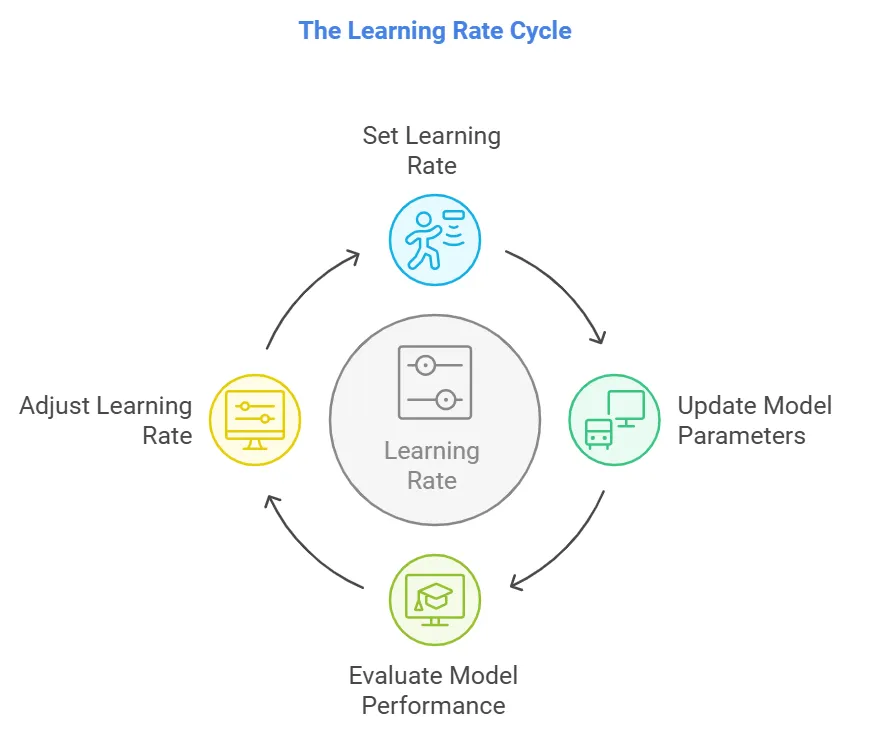
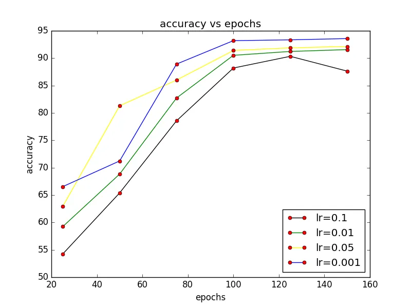
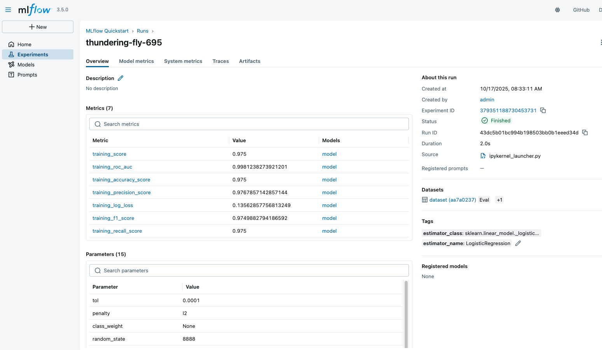
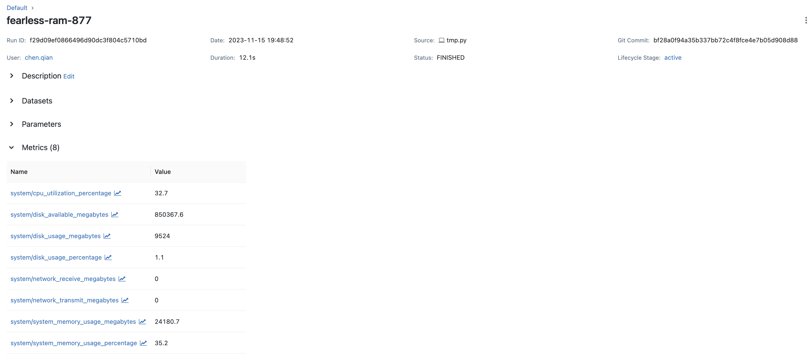

# ML Engineering for Production <br> (DSAI 406)
## Lecture 3

Mohamed Ghalwash
<Email v="mghalwash@zewailcity.edu.eg" />

---
layout: fact
---

# Recording is NOT allowed 

---
layout: top-title
---

:: title :: 

# Lecture 2 Recap

:: content :: 

- Git
- Conda
- Docker

---
layout: top-title-two-cols
---

:: title :: 

# How to train your model?

:: left :: 


<div>
  
</div>


- **Hyperparameter optimization** <span class="text-sm opacity-60">Finding the right LR, batch size, etc.</span>
- **Saving models** <span class="text-sm opacity-60">Version control for binary artifacts.</span>


:: right :: 

<div>
  
</div>

- **Record multiple metrics** <span class="text-sm opacity-60">Comparing Accuracy vs. Loss vs. Time.</span>
- **Choose the best model** <span class="text-sm opacity-60">Data-driven decision making.</span>

---
layout: top-title
---

:: title :: 

# Why not just use Excel for Tracking?

:: content :: 

<div class="grid grid-cols-2 gap-10 pt-4">

<div class="space-y-6">
  <p class="text-xl italic text-gray-500">
    "You find a 'perfect' model, but two weeks later..."
  </p>

  <div class="bg-red-50 dark:bg-red-900/20 border-l-4 border-red-500 p-4 space-y-4">
    <div class="flex items-center gap-3">
      <div class="i-carbon-query text-red-500 text-2xl" />
      <p>Which version of the <b>data</b> was used?</p>
    </div>
    <div class="flex items-center gap-3">
      <div class="i-carbon-settings-adjust text-red-500 text-2xl" />
      <p>What was the <b>learning rate</b>?</p>
    </div>
    <div class="flex items-center gap-3">
      <div class="i-carbon-branch text-red-500 text-2xl" />
      <p>Which <b>Git commit</b> produced this logic?</p>
    </div>
  </div>
</div>

<div class="flex flex-col justify-center items-center bg-gray-50 dark:bg-gray-800/50 rounded-xl p-6 border border-dashed border-gray-300">
  <div class="i-carbon-document-import text-6xl text-gray-400 mb-4" />
  <p class="text-center text-sm font-mono text-gray-500">
    manual_tracker_v2_final_FINAL.xlsx
  </p>
  <div class="w-full mt-4 h-2 bg-gray-200 rounded-full overflow-hidden">
    <div class="bg-red-400 h-full w-3/4"></div>
  </div>
  <p class="text-[10px] mt-2 text-red-400 uppercase tracking-widest font-bold">Error: Human Error Imminent</p>
</div>

</div>

<v-click> 

<div class="mt-10 bg-blue-600 text-white p-4 rounded-lg shadow-lg flex items-center justify-between">
  <span class="text-lg font-semibold">The Solution: A Digital "Lab Notebook"</span>
  <div class="flex gap-4">
    <code class="bg-blue-800 px-3 py-1 rounded text-sm">MLflow</code>
    <code class="bg-blue-800 px-3 py-1 rounded text-sm">TensorBoard</code>
  </div>
</div>

</v-click> 

<!-- # Moving from Reproducibility to Observability (MLflow)  -->


---
layout: top-title
---

:: title :: 

# MLflow: The Three Pillars
### More than just a logger

:: content :: 

<p class="mb-8 opacity-80">
  An open-source platform to manage the full ML lifecycle, ensuring each phase is 
  <span class="text-blue-500 font-bold">manageable</span>, 
  <span class="text-green-500 font-bold">traceable</span>, and 
  <span class="text-purple-500 font-bold">reproducible</span>.
</p>

<div class="grid grid-cols-3 gap-6">

<v-click> 

<div class="bg-blue-50 dark:bg-blue-900/10 p-5 rounded-xl border-t-4 border-blue-500 shadow-sm">
  <div class="i-carbon-ChartLine text-3xl text-blue-500 mb-3" />
  <h3 class="text-blue-600 font-bold mb-2">1. Tracking</h3>
  <p class="text-sm opacity-90 leading-relaxed">
    Record and query experiments. Log your <b>code, data, config, and results</b> in one central place.
  </p>
</div>

</v-click> 

<v-click> 

<div class="bg-green-50 dark:bg-green-900/10 p-5 rounded-xl border-t-4 border-green-500 shadow-sm">
  <div class="i-carbon-Package text-3xl text-green-500 mb-3" />
  <h3 class="text-green-600 font-bold mb-2">2. Models</h3>
  <p class="text-sm opacity-90 leading-relaxed">
    Standard format for packaging models (<b>Flavors</b>). Works on any platform (Docker, Spark, Cloud).
  </p>
</div>

</v-click> 

<v-click> 

<div class="bg-purple-50 dark:bg-purple-900/10 p-5 rounded-xl border-t-4 border-purple-500 shadow-sm">
  <div class="i-carbon-FlowData text-3xl text-purple-500 mb-3" />
  <h3 class="text-purple-600 font-bold mb-2">3. Registry</h3>
  <p class="text-sm opacity-90 leading-relaxed">
    A central hub to manage lifecycle stages. Promote models from <b>Staging</b> to <b>Production</b>.
  </p>
</div>

</v-click> 

</div>

---
layout: top-title
---

:: title :: 

# 1. Experiment Organization
### Comparing multiple runs at a glance

:: content :: 

The **MLflow Table** is your command center. No more scrolling through terminal logs to find your best accuracy.

<div class="grid grid-cols-3 gap-6">
  <div class="col-span-1 space-y-4">
    <div class="bg-blue-50 dark:bg-blue-900/20 p-4 rounded-lg border-l-4 border-blue-500">
      <p class="font-bold">The Goal</p>
      <p class="text-sm">Group runs by project and filter by the best results.</p>
    </div>
    <ul class="text-sm space-y-2 opacity-80">
      <li>✅ Filter by <code>metrics.accuracy > 0.9</code></li>
      <li>✅ Sort by training time</li>
      <li>✅ Search by specific tags</li>
    </ul>
  </div>
  <div class="col-span-2">
    
  </div>
</div>

---
layout: top-title
---

:: title :: 

# 2. Metric Visualization
### Beyond the final number

:: content :: 

Don't just look at the final score; look at the **learning curve**.

<div class="grid grid-cols-2 gap-8">
  <div class="flex flex-col justify-center">
    <h4 class="text-green-600 font-bold mb-2">Interactive Charts</h4>
    <p class="opacity-80 mb-4">MLflow automatically generates plots for every metric you log.</p>
    <ul class="space-y-3">
      <li class="flex items-center gap-2"><div class="i-carbon-checkmark text-green-500" /> Compare multiple runs on one graph</li>
      <li class="flex items-center gap-2"><div class="i-carbon-checkmark text-green-500" /> Zoom into specific epochs</li>
      <li class="flex items-center gap-2"><div class="i-carbon-checkmark text-green-500" /> Identify Overfitting / Underfitting early</li>
    </ul>
  </div>
  <div class="col-span-1">
    
  </div>
</div>


---
layout: top-title
---

:: title :: 

# 3. Artifact Storage
### Versioning your "Hard Evidence"

:: content :: 

An **Artifact** is any file produced by your code. MLflow links these files directly to the specific run that created them.

<div class="grid grid-cols-1 gap-10">
  <div class="space-y-4">
    <p>Everything your script generates is stored safely:</p>
    <div class="grid grid-cols-2 gap-2">
      <div class="p-3 bg-gray-100 dark:bg-gray-800 rounded text-center text-xs"><b>.pkl / .pt</b><br>Model Weights</div>
      <div class="p-3 bg-gray-100 dark:bg-gray-800 rounded text-center text-xs"><b>.png / .html</b><br>Confusion Matrix</div>
      <div class="p-3 bg-gray-100 dark:bg-gray-800 rounded text-center text-xs"><b>.yaml / .json</b><br>Config Files</div>
      <div class="p-3 bg-gray-100 dark:bg-gray-800 rounded text-center text-xs"><b>.txt</b><br>Requirements</div>
    </div>
  </div>
</div>

---
layout: top-title
class: text-center
---

:: title ::

# 4. Collaboration
### From "My Laptop" to "Our Lab"

:: content :: 

<div class="max-w-2xl mx-auto">

MLflow is designed as a **Client-Server** architecture.

<div class="flex justify-around items-center my-10">
  <div class="p-4 bg-blue-100 dark:bg-blue-900/30 rounded">Student A</div>
  <div class="i-carbon-arrow-right text-2xl" />
  <div class="p-8 bg-blue-600 text-white rounded-full shadow-lg">MLflow Tracking Server</div>
  <div class="i-carbon-arrow-left text-2xl" />
  <div class="p-4 bg-blue-100 dark:bg-blue-900/30 rounded">Student B</div>
</div>

> **The Power of Shared Tracking:** You can see your teammate's hyperparameters and results in real-time, preventing redundant work and accelerating discovery.

</div>

<!-- 
- **Experiment Organization**: Track and compare multiple model experiments
- **Metric Visualization**: Built-in plots and charts for model performance
- **Artifact Storage**: Store models, plots, and other files with each run
- **Collaboration**: Share experiments and results across teams -->
  
---
layout: top-title
---

:: title :: 

# Using MLflow with PyTorch
### Logging the "Identity" of your Run

:: content :: 

```python{1,3|5|6,7|9-14|16,17|19,20|all}
import mlflow

mlflow.set_experiment("Experiment Id/Name")

with mlflow.start_run():
    # 1. Tags: For searching (e.g., "show me all CNN runs")
    mlflow.set_tag("model_type", "CNN")
    
    # 2. Params: The "Input" config
    mlflow.log_params({
        "learning_rate": 0.01,
        "batch_size": 32,
        "optimizer": "Adam"
    })
    
    # 3. Metrics: The "Output" results
    mlflow.log_metric("final_accuracy", 0.98)

    # 4. logging the model, instead of just torch.save(model.state_dict())
    mlflow.pytorch.log_model(model, name="model")
```

---
layout: center
class: text-center
---

# Learn More

[Course Homepage](https://github.com/m-fakhry/DSAI-406-MLOps)
