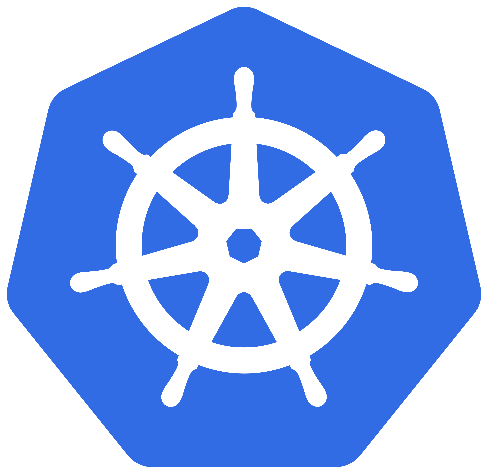
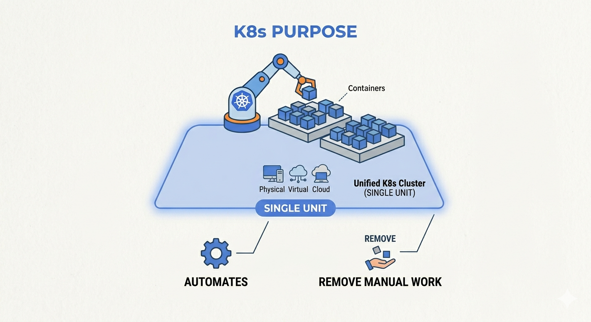
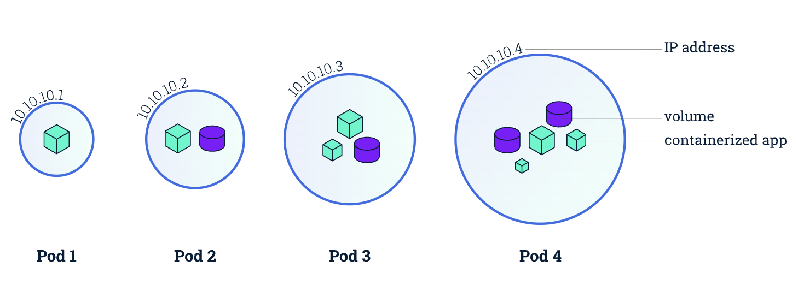
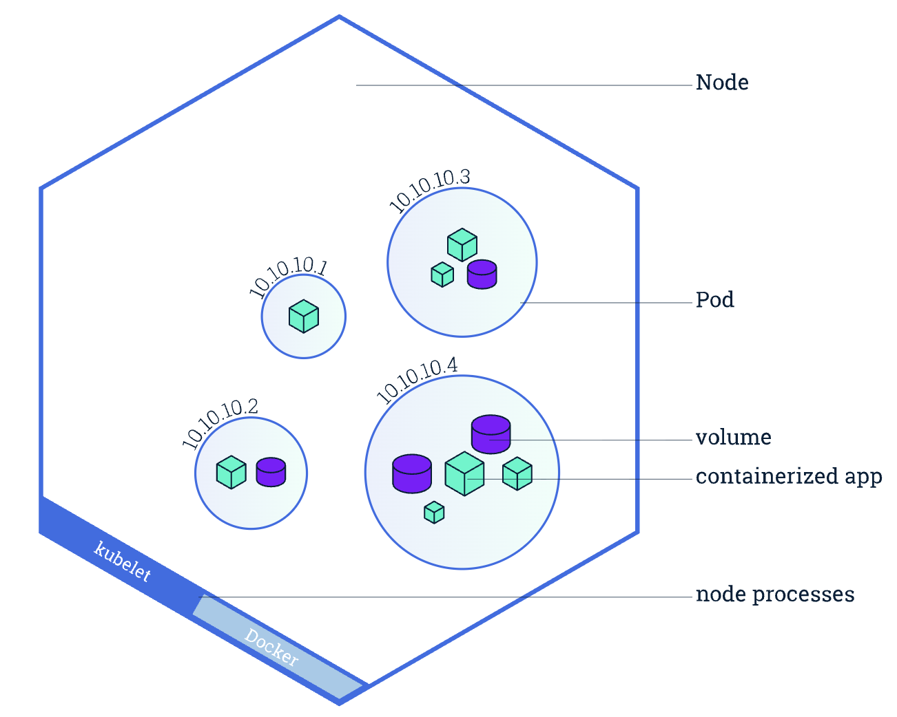
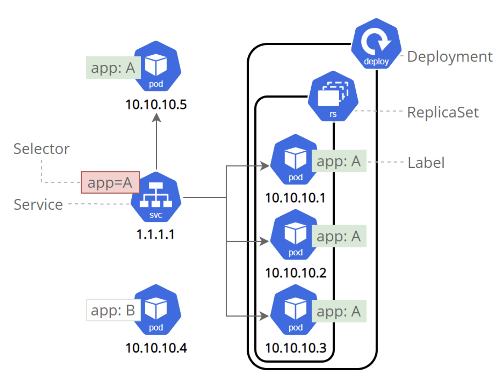
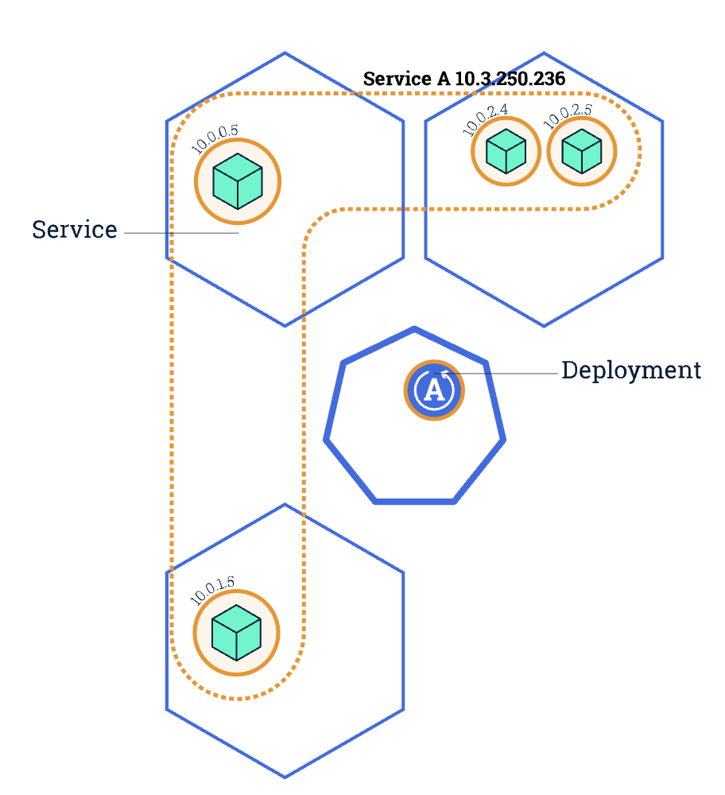
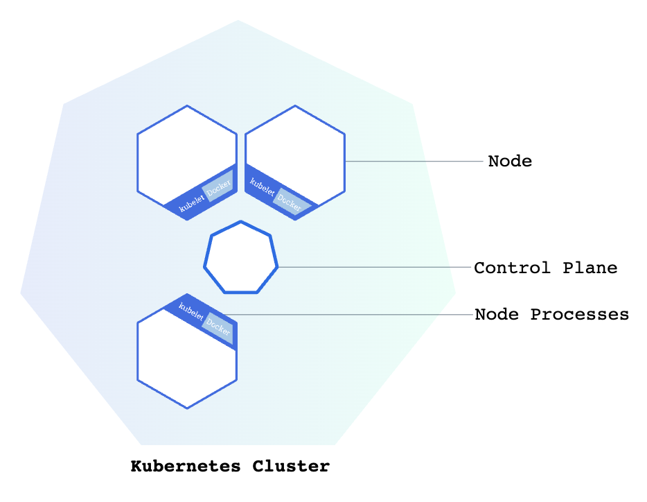
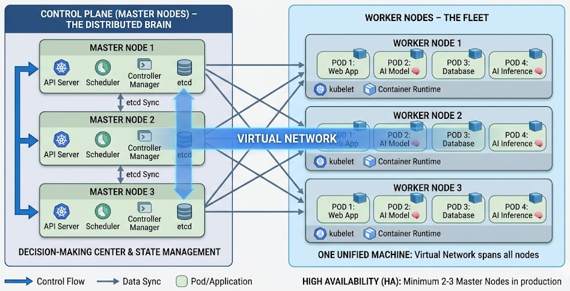

# ML Engineering for Production <br> (DSAI 406)
## Lecture {{$slidev.configs.lecture}}

Mohamed Ghalwash
<Email v="mghalwash@zewailcity.edu.eg" />

---
layout: fact
---

# Recording is NOT allowed 

---
layout: top-title
---

:: title :: 

# Recap 

:: content :: 

- Git 
- Docker, Dockerfile 
- CI/CD (GHA) [job, steps, env, secretes]
- DVC 


---
layout: top-title 
---

:: title :: 

# Motivation: PersonaCanvas

:: content ::

A platform where users upload a photo of their pet or a description of a scene, and an AI agent generates a high-quality artistic portrait which is then printed on a physical canvas and shipped to their house. 
What are the components of that system?{.text-red-400}

<div class="grid grid-cols-2 gap-4 mt-10">

<div>

<v-click>

**System Components**
- 🌐 **Web Application** (FastAPI / Streamlit)
- 🧠 **AI Generative Model** (Stable Diffusion)
- 🖨️ **Printing Service** 
- 💳 **Payment Gateway** (Stripe/PayPal)
- 📦 **Shipping & Logistics** (DHL/FedEx API)
  
</v-click>


</div> 

<v-click>

<div class="flex flex-col justify-center items-center h-full border-l border-gray-500/30 pl-4">

**The Big Question:**

**Should we have all these components in one container?**{.text-red-500}

</div>

</v-click>

</div>  

---
layout: top-title
---

:: title :: 

# Why Separate These Components?

:: content :: 

- **Efficient Resource Usage**: Assign expensive GPU resources only to the AI component, while the Web App on standard CPU nodes

- **Independent Scaling**: Scale the WebApp model during high demand, while keep the Shipping/Payment containers small when not in use

- **Fault Isolation & Resilience**: One crash doesn't take down the entire store

- **Seamless Communication**: Standardized talk via **REST APIs**

<br>

<v-click>

> **How do we orchestrate and manage all these moving parts?**{.text-blue-500 .text-xl .font-bold}
</v-click>

---
layout: cover 
--- 

# Kubernetes 


{style="zoom:.03"}

---
layout: top-title
---

:: title :: 

# What is Kubernetes (K8s)? 

:: content ::

**Kubernetes** coordinates a highly available cluster of computers that are connected to work as a single unit

- **The Core:** An open-source platform that automates container orchestration across physical, virtual, or cloud environments
- **The Purpose:** Removing the manual labor from managing 100s of containers

<div class="flex justify-center text-center"> 

{style="zoom:.3"}

</div>

<v-click>
<div class="absolute inset-0 flex flex-col items-center justify-center pointer-events-none">
  <div class="text-4xl font-bold text-red-600 bg-white p-8 shadow-2xl rounded-xl border-4 border-red-600 transform -rotate-2">
    What is 8 in K8s?
  </div>
</div>
</v-click>


---
layout: top-title 
---
:: title :: 

# K8s in the AI Lifecycle

:: content :: 

<div class="grid grid-cols-3 gap-4">

<div class="border border-main p-4 rounded shadow-sm">

<v-click>

### 🚀 Deploying
**Automatic Rollouts** 
- Responsible for creating and updating instances of your application without downtime

</v-click>
</div>

<div class="border border-main p-4 rounded shadow-sm">
<v-click>

### 📈 Scaling
**Resource Efficiency**
- Distribute workloads across multiple **GPUs** and nodes
- Scale up for heavy inference; scale down to save costs
</v-click>
</div>

<div class="border border-main p-4 rounded shadow-sm">
<v-click>

### ☁️ Portability
**No Vendor Lock-in**
- Run your ML pipelines on AWS, Google Cloud, or your own on-premise university servers
</v-click>
</div>

</div>

<v-click>

**Summary:** K8s is the "OS" for the modern cloud-native data center{.mt-10 .text-center .text-blue-500 .font-bold}

</v-click>

---
layout: top-title
---

:: title :: 

# K8s Cluster Architecture 

:: content ::

{style="zoom:0.95"}

---
layout: top-title-two-cols
columns: is-9
---

:: title :: 

# K8s Architecture: The Control Plane (Main Node)

:: left ::

To manage the cluster and deploy your AI models, you must pass through the **"Brain"** of the system

- **The Main Gate: API Server**
  The central entry point for all commands. The API Server validates and processes the request

- **Storage: etcd**
  The cluster's database. It maintains the current information for every configuration, pod status, and resource detail

- **The Brain: Scheduler & Controller Manager**
  - **Scheduler:** Matches your Pods to the best available Node (e.g., finding the Node with an available **GPU**)
  - **Controller Manager:** It ensures the *Current State* of the cluster matches your *Desired State*

<!-- <v-click>

<div class="mt--4 p-4 bg-blue-500/10 border-l-4 border-blue-500">

`Your Terminal` $\rightarrow$ `API Server` $\rightarrow$ `Scheduler` $\rightarrow$ `Worker Nodes`

</div>

</v-click> -->

:: right :: 

{style="zoom:0.9"}

---
layout: top-title
---

:: title :: 

# K8s Architecture: Pod

:: content ::

{style="zoom:.6"}

The smallest unit in K8s. A "logical host" for one or more containers. All containers share the same network (IP) and storage volumes

Each Pod in a Kubernetes cluster has a unique IP address


---
layout: top-title-two-cols
columns: is-8
align: l-lm-lm
---

:: title :: 

# K8s Architecture: Node

:: left ::

{style="zoom:0.3"}

:: right :: 

A worker machine (VM or Physical). Think of it as the "hardware" where your Pods actually live

**Self-healing mechanism**: If the Node hosting an instance goes down or is deleted, the controller replaces the instance with an instance on another Node in the cluster. This provides a self-healing mechanism to address machine failure or maintenance

---
layout: top-title-two-cols
columns: is-4
align: l-lm-lm
---

:: title :: 

# K8s Architecture: Service

:: right ::

{style="zoom:0.3"}
<!-- {style="zoom:.4"} -->

:: left :: 

Services are the abstraction that allows pods to die and replicate in Kubernetes without impacting your application

The stable entry point. Since Pods die and restart with new IPs, a Service provides a <b>fixed address</b> and acts as a load balancer


---
layout: top-title-two-cols
columns: is-4
align: l-lm-lm
---

:: title :: 

# K8s Architecture: Cluster

:: right ::

{style="zoom:.5"}

:: left :: 

The big picture. A set of nodes working together, managed by a central <b>Control Plane</b>


---
layout: top-title
---

:: title :: 

# Key K8s Concepts

:: content :: 

<div class="grid grid-cols-2 gap-x-10 gap-y-4 text-sm">

<div>
  <h3 class="text-blue-500">📦 Pod</h3>
  <p>The smallest unit in K8s. A "logical host" for one or more containers. They share the same network (IP) and storage volumes.</p>
</div>

<div>
  <h3 class="text-blue-500">🖥️ Node</h3>
  <p>A worker machine (VM or Physical). Think of it as the "hardware" where your Pods actually live.</p>
</div>

<div>
  <h3 class="text-blue-500">🤖 Kubelet</h3>
  <p>The "Manager on the Ground." An agent running on each node for managing the node and communicating with the Kubernetes control plane. </p>
</div>

<div>
  <h3 class="text-blue-500">🌐 Service</h3>
  <p>The stable entry point. Since Pods die and restart with new IPs, a Service provides a <b>fixed address</b> and acts as a load balancer.</p>
</div>

<div>
  <h3 class="text-blue-500">📂 Volume</h3>
  <p>Persistent storage. Can be local to the cluster or remote (S3, Google Drive, Cloud Storage).</p>
</div>

<div>
  <h3 class="text-blue-500">🏗️ Cluster</h3>
  <p>The big picture. A set of nodes working together, managed by a central <b>Control Plane</b>.</p>
</div>

</div>

<!-- <v-click>

<div class="mt--2 p-4 bg-gray-500/10 border-l-4 border-blue-500">
  <b>Crucial Concept:</b> In 95% of cases, 1 Pod = 1 Container. We only put multiple containers in one Pod if they are tightly coupled
</div>

</v-click> -->

> Crucial Concept: In 95% of cases, 1 Pod = 1 Container. We only put multiple containers in one Pod if they are tightly coupled

---
layout: top-title
---

:: title :: 

# K8s Cluster Architecture 

:: content ::

{style="zoom:0.95"}
<!-- {width="10px"}  -->

---
layout: top-title
---

:: title :: 

# Pods, Nodes, and Network Stability

:: content ::

- **The Pod Environment**
  - Containers in the same pod share **storage** and a **local network** (localhost)
  - Each pod lives on a **Node** and is assigned a unique, internal IP address

- **The "Ephemeral" Nature of Pods**
  - Pods are temporary. If a pod dies (OOM, crash, or node failure), it is replaced
  - The new pod gets a **different IP address**, which breaks direct communication

- **Services**
  - A **Service** provides a **Permanent IP address** (Virtual IP)
  - It acts as a stable "front-door." Even if the pods behind it restart and change IPs, the Service IP stays the same

---
layout: top-title
---

:: title :: 

# Pods, Nodes, and Network Stability

:: content ::

- **Accessing the Application**
  - **Internal Service:** Communication inside the cluster (e.g., Web App talking to AI Model)
  - **External Service:** Exposing the app to the world (e.g., `http://<node-ip>:<port>`)

<v-click>

> **Key Takeaway:** Never talk to a Pod IP. Always talk to a Service! {.text-blue-500 .font-bold .mt-20}

</v-click>
---
layout: top-title
---

:: title :: 

# The Cluster Anatomy: Master vs. Worker Nodes

:: content ::

<div class="flex justify-center items-center">

{style="zoom:0.6"}

</div>

A Kubernetes cluster is essentially a distributed brain (Master) controlling a fleet of workers (Nodes), all tied together by a Virtual Network.

**High Availability (HA)**: In production, we use at least **two (or three)** Master Nodes to ensure the cluster stays alive even if one control plane fails

<!-- <v-click>

**Design Principle:** Master nodes manage; Worker nodes work. {.text-blue-500 .font-bold .mt-10}

</v-click> -->

---
layout: cover
---

# Let's Try It

---
layout: cover
---

# Ready to Build the Cluster?
Local Setup

---
layout: top-title-two-cols
---

:: title ::

# The Local Cluster

:: left ::

### 1. **Minikube**
A tool that runs a single-node K8s cluster inside a Virtual Machine or Docker

- Master + Worker: Combined into one machine for local testing.

<br>

### 2. **kubectl**
The command-line for Kubernetes used to start, stop, scale, and delete resources.

- Sends your YAML files to the API Server.

:: right ::

<div class="ml-10 mt-10 p-5 bg-gray-800/50 rounded-lg border border-white/10">

### Quick Start Commands

```bash
# 1. Start the cluster
minikube start

# 2. Check the status
kubectl cluster-info

# 3. See the "Node"
kubectl get nodes
```
</div>

---
layout: top-title
---

:: title :: 

# Demo: Running PersonaCanvas on Minikube

:: content ::

We will deploy a simplified version of our app using two public Docker images to see how K8s manages the communication.

<div class="grid grid-cols-2 gap-4 mt-4">

<div class="bg-gray-500/5 p-4 rounded border-b-2 border-blue-500">
<h4>🌐 Web Frontend</h4>
<ul>
  <li><b>Image:</b> <code>python:3.9-slim</code></li>
  <li><b>Role:</b> User interface & API Gateway</li>
  <li><b>Port:</b> 8000</li>
</ul>
</div>

<div class="bg-gray-500/5 p-4 rounded border-b-2 border-purple-500">
<h4>🧠 AI Inference Engine</h4>
<ul>
  <li><b>Image:</b> <code>pytorch/torchserve</code></li>
  <li><b>Role:</b> Heavy lifting (Model inference)</li>
  <li><b>Port:</b> 8080</li>
</ul>
</div>

</div>

---
layout: top-title
---

:: title :: 

# Demo: The Workflow we will implement

:: content ::

We will deploy a Streamlit frontend and an Object Detection AI engine on our local cluster

1. **Setup: The Environment** 🛠️
   - Install `minikube` (the local cluster) and `kubectl` (the command tool)
   - Start the cluster: `minikube start`

2. **Define: The Blueprint** 📝
   - Create a `deployment.yaml` defining our **AI Model** and **Web App**
   - Set resource limits (CPU/Memory) for each

3. **Apply: The Execution** 🚀
   - Use `kubectl apply -f deployment.yaml`
   - The **API Server** receives the file and the **Scheduler** finds a home for our pods

---
layout: top-title
---

:: title :: 

# Demo: The Workflow we will implement

:: content ::

4. **Expose: The Gateway** 🚪
   - Create a **Service** YAML to give our Streamlit app a stable IP
   - Link the Frontend to the AI Backend via internal DNS

5. **Inspect: The Result** 🔍
   - `kubectl get pods` to watch the containers come to life
   - `minikube service streamlit-frontend` to open the app in your browser!

---
layout: top-title
---

:: title :: 

# Interacting with the API Server

:: content ::

There are two primary ways to manage your cluster. Choosing the right one depends on whether you are "testing" or "building"

1. **Imperative (`kubectl`):** Using direct commands in your terminal to create or modify resources
- Best for testing, debugging, and one-off experiments
- Pros: Fast execution, immediate feedback
- Cons: Hard to repeat, no history, prone to human error
2. **Declarative (YAML)**: Defining your desired state in a configuration file
- Best for production environments and teamwork
- Pros: Version Control (Git), easy to modify, fully repeatable
- Cons: Slightly slower to write initially

---
layout: top-title
---

:: title :: 

# Interacting with the API Server

:: content ::

<div class="mt-8 p-4 bg-blue-500/10 border-l-4 border-blue-500">

**Rule of Thumb:**
- Use `kubectl` to **inspect** the cluster
- Use `YAML` to **configure** the cluster

</div>


---
layout: top-title
---

:: title :: 

# Defining the Deployment: `deployment.yaml`

:: content ::

The Deployment file tells K8s exactly how to run the containers.

```yaml {all|2|3-4|7-9|12-13|15-19|10-19}
apiVersion: apps/v1
kind: Deployment
metadata:
  name: personacanvas-frontend
spec:
  replicas: 3 # Desired State: Always keep 3 pods running
  selector:
    matchLabels:
      app: web-ui
  template:
    metadata:
      labels:
        app: web-ui # This label links the Pod to the Service
    spec:
      containers:
      - name: streamlit-app
        image: almond/streamlit-k8s-demo:latest
        ports:
        - containerPort: 8501
```

---
layout: top-title
---

:: title :: 

# Exposing the App: `service.yaml`

:: content ::

Since Pod IPs are unstable, we create a **Service** to act as a permanent entry point

How to **Expose** that deployment so you can actually see it in the browser

```yaml {all|2|6|7-8|9-12}
apiVersion: v1
kind: Service
metadata:
  name: frontend-service
spec:
  type: NodePort # Makes the service accessible outside the cluster
  selector:
    app: web-ui # This MUST match the label in the Deployment
  ports:
    - protocol: TCP
      port: 80       # Port the service listens on
      targetPort: 8501 # Port the Streamlit container is running on
```

<!-- `minikube service frontend-service` -->

<!-- We need to add commands to show how to do it CTL  -->

---
layout: center
class: text-center
---

# Learn More

[Course Homepage](https://github.com/m-fakhry/DSAI-406-MLOps)
