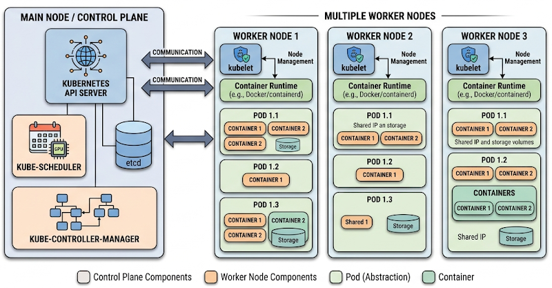
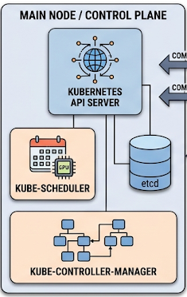

# ML Engineering for Production <br> (DSAI 406)
## Lecture {{$slidev.configs.lecture}}

Mohamed Ghalwash
<Email v="mghalwash@zewailcity.edu.eg" />

---
layout: fact
---

# Recording is NOT allowed

---
layout: top-title-two-cols
columns: is-4
---

:: title :: 

# Recap 

:: left :: 

- Kubernetes 
- Architecture 
  - Control plane 
  - Cluster, pods, nodes, services 

:: right :: 

{style="zoom:1"}


---
layout: top-title
---

:: title :: 

# Demo: Running PersonaCanvas on Minikube

:: content ::

<div class="grid grid-cols-2 gap-4 mt-4">

<div class="bg-gray-500/5 p-4 rounded border-b-2 border-blue-500">
<h4>🌐 Web Frontend (Streamlit)</h4>
<ul>
  <li><b>Image:</b> <code>your-docker-username/streamlit-web:latest</code></li>
  <li><b>Role:</b> User interface & Request Handling</li>
  <li><b>Port:</b> 8501</li>
</ul>
</div>

<div class="bg-gray-500/5 p-4 rounded border-b-2 border-purple-500">
<h4>🧠 AI Inference Engine</h4>
<ul>
  <li><b>Image:</b> <code>your-docker-username/personacanvas-backend:latest</code></li>
  <li><b>Role:</b> Pattern discovery & Image generation</li>
  <li><b>Port:</b> 5000</li>
</ul>
</div>

</div>

---
layout: top-title
---

:: title :: 

# Demo: The Workflow we will implement

:: content ::

We will deploy a Streamlit frontend and an Object Detection AI engine on our local cluster

1. Setup the environment 🛠️

2. Define the deployment 📝

3. Expose the gateway 🚪

4. Apply the execution 🚀

5. Inspect the result 🔍


---
layout: top-title
---

:: title :: 

# Step 1: Setup the environment 

:: content ::

- Install `minikube` (the local cluster) 
  - A tool that runs a single-node K8s cluster inside a Virtual Machine or Docker
  - Combines master and worker nodes into one machine for local testing

- Install `kubectl` (the command tool)
  - The command-line for Kubernetes used to start, stop, scale, and delete resources
  - Sends your YAML files to the API Server

- Start the cluster: `minikube start`

---
layout: top-title
---

:: title :: 

# Step 2: Defining the Deployment

:: content ::

The Deployment file tells K8s exactly how to run the containers
- Pod
  - containers: what docker images to be deployed and on which port 
  - pod label: used to match the pod with the service 
  - resources: memory and computing resources for the pod
- Replicas: number of desired running instances 

> Can be done using either a YAML file (declarative) or pure `kubectl` commands (imperative)

---
layout: top-title
---

:: title :: 

# Step 2: Declarative Way `deployment.yaml`

:: content ::

```yaml {1-3|4-10|11-16}
# Tells K8s we are creating a Deployment using the standard apps API
apiVersion: apps/v1
kind: Deployment # either Deployment or Service 
metadata:
  name: personacanvas-frontend # Mandatory: the unique name for this deployment in your cluster
  labels: # Optional: keywords for organization 
    owner: company-x
    app: streamlit-web
    tier: frontend 
    version: 1.1
spec:
  replicas: 3 # desired number of instances of your app to be running
  selector: # how the Deployment finds the Pods it is responsible from managing
    ...
  template: # The "blueprint" for the Pods
    ...
```
<v-click at="1">

- `kubectl delete deployment personacanvas-frontend`

- `kubectl get deployments -l tier=frontend`
</v-click>
  

---
layout: top-title
---

:: title :: 

# Step 2: Declarative Way `deployment.yaml`

:: content ::

```yaml {6-9|3-9|10-}
spec:
  replicas: 3 # to ensure 3 copies of your app are always running (desired)
  selector: # how the Deployment finds the Pods it is supposed to manage
    matchLabels:
      app: streamlit-web
  template: # The "blueprint" for the Pods
    metadata:
      labels: # Key-value pairs used to "hook" Pods to Services
        app: streamlit-web
    spec:
      containers: # why multiple containers? 
      - name: ... # optional name 
        image: ... # the Docker image to run
        ports: ... # ports for your app 
        resources: ... # resources for the pod 
```

---
layout: top-title
---

:: title :: 

# Step 2: Declarative Way `deployment.yaml`

:: content ::

```yaml {all}
    spec:
      containers:
      - name: streamlit-container # optional name 
        image: your-docker-username/streamlit-image:latest # the Docker image to run
        ports:
        - containerPort: 8501 # the port your application is listening on
        resources: # required resources for the pod 
          requests: # the minimum amount guaranteed to the Pod
            cpu: "250m" # 0.25 core, 
            memory: "256Mi"
          limits: # the maximum amount the Pod is allowed to consume
            cpu: "500m" # 0.5 core. If a Pod hits its limit, Kubernetes slows down the CPU but doesn't kill the Pod
            memory: "512Mi" # If a Pod tries to exceed its memory Limit, Kubernetes will immediately kill the process
```

---
layout: top-title 
---

:: title :: 

# Step 2: Web Service Deployment 

:: content :: 

<div style="zoom:0.8"> 

```yaml {all}
apiVersion: apps/v1
kind: Deployment # either Deployment or Service 
metadata:
  name: personacanvas-frontend # Mandatory: the unique name for this deployment in your cluster
  labels: # Optional: keywords for organization 
    ...
spec:
  replicas: 3 # to ensure 3 copies of your app are always running (desired)
  selector: # how the Deployment finds the Pods it is supposed to manage
    matchLabels:
      app: streamlit-web
  template: # The "blueprint" for the Pods
    metadata:
      labels: # Key-value pairs used to "hook" Pods to Services
        app: streamlit-web
    spec:
      containers:
      - name: streamlit-container # optional name 
        image: your-docker-username/streamlit-image:latest # the Docker image to run
        ports:
        - containerPort: 8501 # the port your application is listening on
        resources: # required resources for the pod 
          requests: # the minimum amount guaranteed to the Pod
            cpu: "250m" # 0.25 core, 
            memory: "256Mi"
          limits: # the maximum amount the Pod is allowed to consume
            cpu: "500m" # 0.5 core. If a Pod hits its limit, Kubernetes slows down the CPU but doesn't kill the Pod
            memory: "512Mi" # If a Pod tries to exceed its memory Limit, Kubernetes will immediately kill the process
```

</div> 

---
layout: top-title 
---
:: title :: 

# Step 2: AI Engine Deployment 

:: content :: 

Create a similar deployment yaml file for the other AI container

<div style="zoom:0.6"> 

```yaml
apiVersion: apps/v1
kind: Deployment
metadata:
  name: personacanvas-backend
  labels:
    app: image-generator
    tier: backend
spec:
  replicas: 1
  selector:
    matchLabels:
      app: image-generator 
  template:
    metadata:
      labels:
        app: image-generator 
    spec:
      containers:
      - name: generator-core
        image: your-docker-username/image-gen:latest 
        ports:
        - containerPort: 5000
        resources:
          requests:
            memory: "4Gi" # high request for model loading
            cpu: "2000m"  # 2 cores 
            nvidia.com/gpu: 1 # 1 GPU  
          limits:
            memory: "8Gi" # Limit to prevent crashing the Node
            cpu: "4000m" 
            nvidia.com/gpu: 1
```

</div>

---
layout: top-title
---

:: title :: 

# Step 3: Exposing the Gateway `service.yaml`

:: content ::

Since Pod IPs are unstable, we create a **Service** to act as a permanent entry point

How to **Expose** that deployment so you can actually see it in the browser

```yaml {all|2|6|7-8|9-14}
apiVersion: v1
kind: Service
metadata:
  name: streamlit-service
spec:
  type: NodePort # Makes the service accessible outside the cluster
  selector:
    app: streamlit-web # This MUST match the label in the Deployment
  ports:
    - name: web
      protocol: TCP
      port: 80       # port the service listens on (INTERNAL Cluster Port)
      targetPort: 8501 # port the Streamlit container is running on (POD/CONTAINER Port)
      nodePort: 30085   # the external port (range 30000-32767) (EXTERNAL Cluster Port)
```

> This allows other pods in your cluster (like a backend API) to reach the frontend simply by typing `http://streamlit-service:80`


---
layout: top-title
---

:: title :: 

# Step 3: Exposing the Gateway `service.yaml`

:: content ::


1. User enters `http://<Global-Server-IP>:30085` in their browser

2. The NodePort `30085` catches the request on the physical machine

3. The Service looks at its selector and finds all Pods labeled `app: streamlit-web`

4. The Service forwards the traffic to Port `8501` inside one of those Pods

5. The Streamlit App responds with the UI

---
layout: top-title
---
:: title ::

# Step 4: Applying the YAML Files

:: content ::

You can apply the files individually or all at once if they are in the same directory

```bash
# Apply the AI Image Generation Engine
kubectl apply -f image-gen-deployment.yaml

# Apply the Streamlit Frontend
kubectl apply -f streamlit-deployment.yaml

# Apply the Service to expose the UI
kubectl apply -f service.yaml
```

---
layout: top-title-two-cols
columns: is-8
---

:: title ::

# Step 4: The Lifecycle of a Deployment

:: left ::

<!-- <div class="grid grid-cols-2 gap-8 mt-4"> -->

<div class="space-y-4">

1. **API Server (The Gateway)**  
   Receives your `deployment.yaml`, validates the syntax, and acts as the single point of entry for the cluster.

2. **etcd (The Brain)**  
   The cluster’s source of truth. It stores the "Desired State" (e.g., "I must have 3 Streamlit replicas").

3. **Controller Manager (The Muscle)**  
   Monitors `etcd`. It notices the gap between 0 running pods and 3 desired pods, then creates Pod definitions.

4. **Scheduler (The Matchmaker)**  
   Assigns the new Pods to specific Worker Nodes based on available CPU, RAM, and health.

</div>

<!-- <div class="flex flex-col justify-center items-center bg-gray-800/50 rounded-xl p-4 border border-gray-700"> -->


<!-- <div > -->

:: right :: 



<!-- </div>

</div>

</div> -->

<!--
Notes:
- Emphasize that these 4 components never talk to the worker nodes directly; they communicate via the API Server.
- Point out that if etcd goes down, the cluster "freezes" because the brain is missing.
-->

---
layout: top-title
---
:: title ::

# Step 5: Inspect the Results

:: content ::

You need to check if the Controller Manager and Scheduler have successfully started your pods

```bash
# Check the status of your pods
kubectl get pods

# Check the status of your deployments
kubectl get deployments

# Check the service to find the NodePort
kubectl get service streamlit-service

# lists the Internal-IP or External-IP of your servers
kubectl get nodes -o wide
```

---
layout: top-title 
---

# Think about the backend process 

# How the streamlit app talks to the AI engine 


---
layout: section
---

# Tips 
<hr/> 

---
layout: top-title
---

:: title :: 

# Interacting with the API Server

:: content ::

There are two primary ways to manage your cluster. Choosing the right one depends on whether you are "testing" or "building"

1. **Imperative (`kubectl`):** Using direct commands in your terminal to create or modify resources
- Best for testing, debugging, and one-off experiments
- Pros: Fast execution, immediate feedback
- Cons: Hard to repeat, no history, prone to human error
2. **Declarative (YAML)**: Defining your desired state in a configuration file
- Best for production environments and teamwork
- Pros: Version Control (Git), easy to modify, fully repeatable
- Cons: Slightly slower to write initially

---
layout: top-title
---

:: title :: 

# Interacting with the API Server

:: content ::

<div class="mt-8 p-4 bg-blue-500/10 border-l-4 border-blue-500">

**Rule of Thumb:**
- Use `YAML` to **configure** the cluster
- Use `kubectl` to **inspect** the cluster

</div>


---
layout: top-title
---

:: title :: 

# Scaling & Self-Healing in Action

:: content ::

What happens when your PersonaCanvas store goes viral? Or when a container crashes?

- Scaling: you can increase the number of AI model instances instantly
  ```bash
    kubectl scale deployment personacanvas-backend --replicas=10
  ```

  - you can manually "kill" a pod to simulate a crash
  ```bash
  kubectl delete pod < pod-name >
  ```
  - K8s notices the actual state (2 pods) doesn't match the desired state (3 pods) and starts a new one in seconds


- Updating your AI model to a new version without any downtime
```bash
kubectl set image deployment/personacanvas-backend streamlit-web=your-docker-username/new-ai-image:v2
```

---
layout: center
title: References
---

# References

- Chip Huyen, *Designing ML Systems*, Chapter 10.3

- [Nice Tutorial for Kubernetes](https://www.youtube.com/watch?v=s_o8dwzRlu4&t=104s)

- [How to remotely SSH (connect) Visual Studio Code to AWS EC2](https://www.youtube.com/watch?v=sQQjMnEkGjs&t=1s)

---
layout: center
class: text-center
---

# Learn More

[Course Homepage](https://github.com/m-fakhry/DSAI-406-MLOps)
