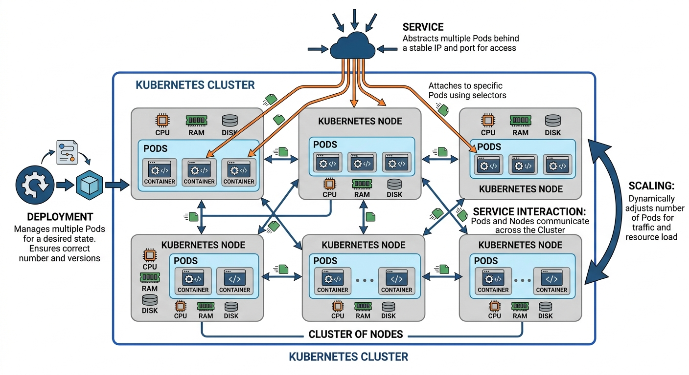
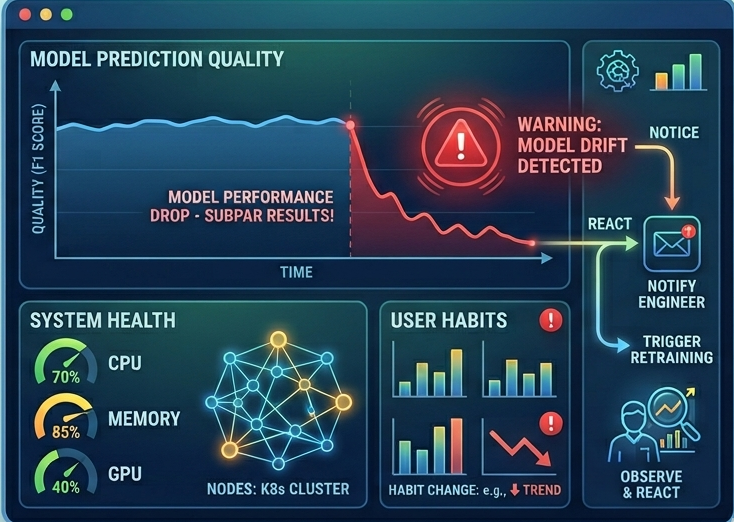
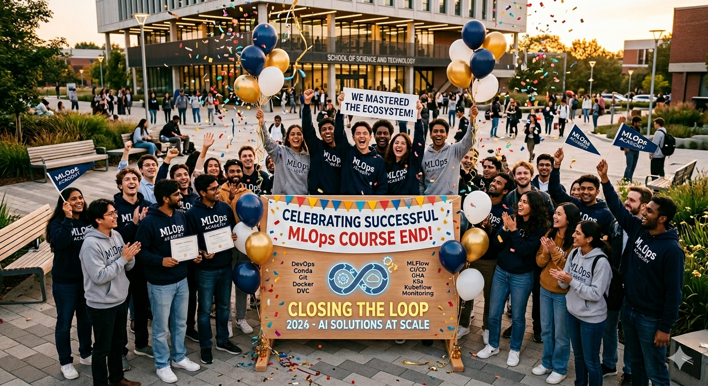

# ML Engineering for Production <br> (DSAI 406)
## Lecture {{$slidev.configs.lecture}}

Mohamed Ghalwash
<Email v="mghalwash@zewailcity.edu.eg" />

---
layout: fact
---

# Recording is NOT allowed

---
layout: top-title
---

:: title :: 

# Recap

:: content :: 

<div class="flex flex-col items-center justify-center h-full text-center space-y-8">
  
  <div class="w-full">
    
  </div>
  
  <div class="flex flex-wrap justify-center gap-3 max-w-3xl px-4">
    <kbd>Kubernetes</kbd> 
    <kbd>Nodes</kbd> 
    <kbd>Deployment and Service</kbd>
    <kbd>Services -> Pods</kbd> 
    <kbd>Services <-> Services</kbd> 
    <kbd>Scaling</kbd>
  </div>

</div>

---
layout: section 
---

# Scaling the Research Lifecycle 

<hr/> 


---
layout: top-title
---

:: title :: 

# Are [GHA + Kubernetes] Enough?

:: content :: 

If I want to retrain the PersonaCanvas model every time 50,000 new images are uploaded to our company storage, where [a new high-quality of 1TB images is collected]{.underline.text-green-600} OR the `image-gen` backend code is modified to use [a new loss function]{.underline.text-red-600}

<!-- GitHub doesn't know those images exist. But Kubeflow, sitting inside our cluster, can 'watch' the storage and trigger a pipeline automatically without a single line of code being changed in Git -->

<!-- [However]{.text-red-500}, the model performance drops by 20% and you don't know:
  * *Which* version of the data was used?
  * *Which* hyperparameters were set in the code?
  * *Where* is the previous "good" Docker image? -->

> - build a script to monitor the storage 
> - trigger the GHA pipeline
> - use GHA to move the data into the vm runner
> - train multiple versions of the model (different hyper parameters)
> - register the best one on MLFlow and containerize the model 
> - use the best image in Kubernets deployment


---
layout: top-title
---

:: title :: 

# Why not just use GitHub Actions?

:: content :: 

We can use GHA to train, push to dockerhub, and update K8s. It works for a "Toy" project but it fails for real-world AI research

- **Data Moving**: Moving 1TB of medical imaging data to a GitHub runner is impossible/expensive because [GHA]{.underline.text-red-400} runners are external, while [K8s]{.underline.text-green-500} runs where the data lives

- **Hardware Limitations**: AI research needs A100/H100 GPUs to train models, [GHA]{.underline.text-red-400} typically runs on standard CPUs and providing your own GHA "Self-Hosted Runners" with GPUs is a management nightmare compared to native [K8s]{.underline.text-green-500} scheduling. In addition, training is a 10-hour GPU process. [K8s]{.underline.text-green-500} manages these workloads natively

- **Caching**: In a 10-hour GPU heavy process, [GHA]{.underline.text-red-400} often forces a total restart of the workflow if task fails in the middle, while [K8s]{.underline.text-green-500} leverages native caching and persistent state.

- **Hyperparameter Tuning**: If you want to run 50 versions of your model to find the best hyperparameters (AutoML), [GHA]{.underline.text-red-400} is linear as it would just queue up 50 jobs while [K8s]{.underline.text-green-500} handles that explosion naturally
  
> We use [GHA]{.underline.text-red-400} to ensure our code is clean (CI) and use [Kubeflow]{.underline.text-green-500} to ensure our science is reproducible (MLOps)


---
layout: top-title 
hide: true 
---

:: title :: 

# GHA: Strengths and Operational Limits

:: content :: 


### Strength

- Primary goal is code integrity (Building, Testing, Pushing Images)
- Trigger on Git events (Push, Pull Request, etc.)
- The basic workflow to (1) Build a docker image, (2) Push to registry, (3) Perform small scale training on a single runner

### Limits

- GHA Isolation: Each job is a separate VM (No easy data sharing).
- Docker Volumes: Local to the VM (If Job B starts on a *new* VM, the Volume is gone).

> **The Operational Wall:** GHA treats every job as an isolated "Clean Slate." How do we get **Job B** to see the **Volume** created by **Job A** if they are on different physical machines? GHA is a **Job Runner**, not a **Resource Scheduler**.


---
layout: section
---

# Transitioning to Kubeflow Pipelines
<hr/>

> Kubeflow is the operating system for the machine learning lifecycle that lives where your data lives.


---
layout: top-title
hide: true
---

:: title :: 

# Why K8s is not Enough for the Pipeline?

:: content :: 

Standard Kubernetes manages **State** (is it running?), but we need to manage **Logic** (is it improving?).

* **The "Orchestration" Gap**
  K8s YAMLs are "always-on." We need "run-and-exit" logic that handles data dependencies automatically.
* **The "Visibility" Gap**
  Even with MLFlow, K8s doesn't natively show you the *graph* of how the data flowed from the scraper to the trainer to the deployer.
* **The "Trigger" Gap**
  Moving from "I pushed code" (GHA) to "The data changed" (Native Cluster Events).

---
layout: top-title-two-cols
---

:: title :: 
# Kubeflow: The Cloud-Native ML Platform

:: right :: 

Kubeflow sits on top of Kubernetes to provide a specialized "Factory" for AI.

- **Notebooks:** Jupyter/VS Code environments running as scalable Pods.
- **Pipelines:** Multi-step workflows (Data → Train → Deploy) that are repeatable.
- **Katib:** Automated hyperparameter tuning (AutoML).
- **KServe:** Advanced model serving with "Scale-to-Zero" to save GPU costs.

:: left :: 


---
layout: center
---

# Why do we use Kubeflow? 

---
layout: section
---

# Scenario 1: The "Data Tax" Mystery
<hr>

### Moving 1TB of Protein Sequences
<br/>
Two pipelines: Preprocess data and train on the new data 

---
layout: top-title-two-cols
---

:: title :: 

# Data Sharing 

:: left :: 

# GHA 

Job A and Job B are on different VMs. Data must be physically moved.

```yaml
# github-action.yaml
jobs:
  preprocess:
    runs-on: ubuntu-latest
    steps:
      - run: python clean.py --out data.zip
      - uses: actions/upload-artifact@v4
        with:
          path: data.zip # Upload

  train:
    needs: preprocess
    runs-on: ubuntu-latest-8-core
    steps:
      - uses: actions/download-artifact@v4 # Download
      - run: python train.py
```
:: right :: 

# Kubeflow 

The data stays on the disk. Task B mounts the same Persistent Volume (PV) Task A just wrote to.

```yaml 
# kubeflow-dag.yaml
components:
  - name: preprocess
    container:
      image: my-cleaner:v1
      outputs: [data_path]
  - name: train
    container:
      image: my-trainer:v1
      inputs: [data_path]
```


---
layout: section
---

# Scenario 2: The "OOM" Issue
<hr> 

### High RAM vs. GPU Training
<br>

You have one physical worker node with **64GB RAM** and **1 GPU**

<br>

1. **Researcher A** starts a "Data Prep" job (Needs 60GB RAM, 0 GPU)
2. **Researcher B** starts a "Training" job (Needs 8GB RAM, 1 GPU)

---
layout: top-title-two-cols
---

:: title :: 

# Resource Sharing 

:: left :: 

GHA is a **Job Runner**, not a **Resource Scheduler**. It assumes the runner can handle the job if it's idle

```yaml
# github-action.yaml
jobs:
  researcher_a:
    runs-on: [self-hosted, gpu-node]
    steps:
      - run: python heavy_prep.py # Uses 60GB

  researcher_b:
    runs-on: [self-hosted, gpu-node]
    steps:
      - run: python train.py # Uses 8GB

```

The OS kills Job A because Job B pushed total RAM to 68GB

:: right :: 

Kubeflow is Resource-Aware. It treats your cluster as a pool of Memory/CPU/GPU.

```yaml
# kubeflow-dag.yaml
- name: heavy-prep
  container:
    resources:
      requests:
        memory: "60Gi"
- name: train
  container:
    resources:
      requests:
        memory: "8Gi"
        nvidia.com/gpu: 1
```

Kubeflow puts Job B in "PENDING" state until Job A  releases the 60GB

---
layout: section
---

# Scenario 3: The "Resume" Logic
<hr>

### Why pay for the same work twice?

<br>

Your Training container (Step 3 of 5) crashes at **Hour 4** for any reason

---
layout: top-title-two-cols
---

:: title :: 

# Caching Problem

:: left :: 

GHA is "all or nothing" per Job.

```yaml
# github-action.yaml
jobs:
  train:
    runs-on: ubuntu-latest
    strategy:
      # Only retries the WHOLE job
      max-parallel: 1 
    steps:
      - name: Fetch Data
        run: python get_data.py # 1 hr
      - name: Train
        run: python train.py # 4 hrs
```

If `train.py` fails, GHA restarts the Job. You lose the 1-hour "Fetch Data" work every time.

:: right ::

Kubeflow treats every node as a **Stateful Entry**.

```yaml
# kubeflow-dag.yaml
- name: fetch-data
  container:
    image: fetcher:v1
  # DEFAULT: Enable Caching
  metadata:
    annotations:
      pipelines.kubeflow.org/cache_enabled: "true"

- name: train
  container:
    image: trainer:v1
  # If Train fails, it ONLY 
  # restarts the Train node.
```

Kubeflow sees the `fetch-data` output in the Metadata Store. It **skips** the 1-hour fetch and goes straight to training.

---
layout: center
---

# How to use Kubeflow? 

---
layout: top-title
lineNumbers: true
---

:: title :: 

# How to make Kubeflow pipeline? 

:: content :: 

```python {1|3-10|12-19|21-22}
from kfp import dsl, compiler

# --- SCENARIO 1: DATA SHARING
# Kubeflow use InputPath and OutputPath to automatically handle the Persistent Volume so Task B sees Task A's files

@dsl.component(base_image='python:3.9')
def preprocess_data(data_path: str, cleaned_data: dsl.OutputPath(str)):
    ...
    with open(cleaned_data, 'w') as f:
        f.write("/mnt/data/cleaned_sequences.bin") # instead of moving data, we just write the path to a shared volume

# --- SCENARIO 2: THE OOM & Resource Sharing
# K8s will queue 'train_model' if the 60GB RAM 'preprocess' job is already occupying the worker node.

@dsl.component(base_image='pytorch/pytorch:latest', packages_to_install=['mlflow'])
def train_model(cleaned_data_path: dsl.InputPath(str), epochs: int, lr: float):
    # Loading data from {cleaned_data_path}
    ...
    mlflow.log_param("learning_rate", lr)

# --- SCENARIO 3: Caching
# If you run this pipeline twice with the same 'data_path', it will show "Taken from Cache".
```

---
layout: top-title
---

:: title :: 

# How to make Kubeflow pipeline? 

:: content :: 

```python{all|1-2|4-6|9-11|13|16-17|all}
@dsl.pipeline(name="personacanvas-research-lifecycle")
def research_pipeline(data_path: str = "s3://.../raw-v1", lr: float = 0.01):
    # Task 1: Preprocess (The High-RAM job)
    prep_task = preprocess_data(data_path=data_path)
    prep_task.set_memory_limit('60Gi')
    prep_task.set_cpu_limit('4')
    
    # Task 2: Train (The GPU job), will wait if Task 1 takes all the RAM
    train_task = train_model(cleaned_data_path=prep_task.outputs['cleaned_data'], epochs=10, lr=lr)
    train_task.set_gpu_limit(1) # nvidia.com/gpu
    train_task.set_memory_limit('8Gi')
    
    # SCENARIO 3: Caching is enabled by default. If train_task fails, re-running the pipeline will skip prep_task.

# --- COMPILATION ---
if __name__ == "__main__":
    compiler.Compiler().compile(research_pipeline, 'research_pipeline.yaml')
```
---
layout: top-title
---

:: title :: 

# Summary: The MLOps Handover

:: content :: 

<div class="grid grid-cols-2 gap-10">

<div>
<h3 class="text-blue-500 mb-4">When to move to Kubeflow?</h3>

* **Caching:** Avoid paying for the same Data Prep twice.
* **Data Locality:** Keeping 1TB+ datasets on-cluster (No VM hopping).
* **Bin-Packing:** Ensuring 100% hardware utilization via K8s scheduling.
</div>

<div>
<h3 class="text-purple-500 mb-4">The Best of Both Worlds</h3>

**GitHub Actions:** The Software Architect 🏗️
> "Is the code tested? Does the Docker Image build correctly?"

**Kubeflow:** The Research Scientist 🧪
> "Is the model accurate? Can we train on local GPUs? Is it reproducible?"
</div>

</div>

<div class="mt-8 p-4 bg-gray-500/10 rounded-lg border-l-4 border-green-500">
  <b>The Bottom Line:</b> GHA builds the <b>Engine</b> (CI), and Kubeflow <b>Drives</b> the experiment (MLOps) on our university hardware.
</div>

---
layout: section
---

# Monitoring and Logging 
<hr/>

---
layout: top-title
---

:: title :: 

# What is Monitoring

:: content :: 

- The goal of monitoring is to track the health of a ML system. This means monitoring their performance and the quality of their predictions
- If a change in user habits suddenly causes a model to produce subpar results, a good monitoring system will allow you to notice and react as soon as possible

<div class="flex flex-col items-center justify-center h-full text-center space-y-8">
  
  <div class="w-full">
    
  </div>
</div>

---
layout: fact
---


# Why Monitor? 

If we can measure, then we can compare. And if we can compare, only then can we improve


---
layout: top-title
---

:: title :: 

# The MLOps Philosophy

:: content :: 

1. **Why monitor?** To detect when user habits shift, causing subpar results before they impact the business.
2. **How to monitor?** Beyond failed requests, we track *information* to catch any drift. Performance and business metrics
3. **What actions to drive?** Monitoring must drive business insight 

<div class="mt-8 p-4 bg-yellow-500/10 border-l-4 border-yellow-500 rounded">
  
  - A model with perfect infrastructure stats but zero business insight is useless
  - A model that works in dev but is a "black box" in production is dangerous
</div>

---
layout: top-title
---

:: title :: 

# The Three Dimensions of Monitoring

:: content :: 

<div class="grid grid-cols-3 gap-6">

<div class="p-4 bg-gray-100 rounded">
<h3 class="text-blue-400">1. Service</h3>
<b>The Infrastructure</b>
<ul>
  <li><b>Prediction Latency:</b> Is the response time spiking?</li>
  <li><b>Performance Cliffs:</b> Does the system fail under specific loads?</li>
  <li><b>Cost:</b> Is the GPU usage cost-effective?</li>
</ul>
</div>

<div class="p-4 bg-gray-200 rounded">
<h3 class="text-green-400">2. Data</h3>
<b>The Input/Output</b>
<ul>
  <li><b>Quality Checks:</b> Are we getting nulls or corrupted strings?</li>
  <li><b>Data Drift:</b> Does the input distribution match the training set?</li>
  <li><b>Concept Drift:</b> The prediction changes given the same input.</li>
</ul>
</div>

<div class="p-4 bg-gray-300 rounded">
<h3 class="text-purple-400">3. Model</h3>
<b>The Logic</b>
<ul>
  <li><b>Real-time Actuals:</b> Instant feedback (e.g., Delivery time).</li>
  <li><b>Delayed Actuals:</b> Long-term feedback (e.g., Fraud/Credit).</li>
  <li><b>Proxy Measures:</b> Used when human labels are missing.</li>
</ul>
</div>

</div>

<!-- I should ask myself these questions: Is my service cost-effective? Does it have any unobvious performance cliffs? Is there data distribution drift? How does service latency, for example, relate to user behavior on the weekend versus the working week?

Monitoring the input distribution can be as simple as monitoring summary statistics such as the mean and variance of key features and raising an alert if these statistics drift away from the values in the training data by more than a given threshold.

A/B testing  -->


---
layout: top-title
---

:: title :: 

# The "Silent Failure" Scenario

:: content ::

The PersonaCanvas **Text-to-Image** engine is live. Your K8s metrics look perfect:
* **Inference Engine:** 200 OK
* **GPU Memory:** Stable at 12GB
* **Queue Depth:** Low (Fast processing)

**The Problem:**
Users are complaining that the generated art looks "soulless" or "repetitive." 
* A month ago, the prompt *"A sunset over Cairo"* produced masterpiece-level art.
* Today, the same prompt produces washed-out, grainy, or distorted images.


---
layout: top-title
---

:: title :: 

# Prompt or Concept Drift

:: content :: 

<div class="grid grid-cols-2 gap-6">

<div>
<h3>1. Prompt Drift (Input)</h3>

Users are using the app differently. 
* **Before:** Simple prompts (*"A cat in a hat"*).
* **Now:** Complex, "Prompt Engineered" strings with 50+ keywords and negative prompts that push the model to the edge of its latent space.
</div>

<div>
<h3>2. Concept Drift (Output)</h3>

The **Target Concept** has shifted.
* The model was optimized for "Artistic Illustrations."
* Users now expect "Hyper-Realistic Photography."
* The **Reward Function** used during training no longer aligns with **User Satisfaction**.
</div>

</div>

<div class="mt-0 bg-gray-400 p-1 rounded-lg">

[How do we monitor a "Generation"?]{.text-blue-800} Standard metrics might not work here. We must monitor using, e.g., CLIP score that measures how well the generated image actually matches the text prompt
</div>

---
layout: top-title
---

:: title :: 

# Solving the Drift: The Closed-Loop System

:: content :: 

To fix the silent failure scenario, we must move to a feedback loop.

* **Step 1: Automated Evaluation (The Monitor)**
  Deploy a sidecar container that calculates the CLIP score for every generation. If the average similarity between the prompt and image falls below $0.25$, trigger an alert.

* **Step 2: Human-in-the-Loop (HITL)**
  Send low-confidence images to a "Labeling UI" where researchers (or users) can give a 👍/👎. This creates a new **Gold Standard** dataset.

* **Step 3: Triggered Retraining (The Kubeflow Link)**
  Once we have 1,000 new "corrected" examples, **Kubeflow** automatically triggers a fine-tuning pipeline to update the model.

> **Result:** The model "learns" the new user preferences (e.g., hyper-realism) without manual intervention.


---
layout: top-title
class: text-center
---

:: title :: 

# The MLOps Lifecycle

:: content :: 

<!-- <hr class="w-20 border-t-3 border-accent mx-auto mb-10" /> -->

<div class="grid grid-cols-3 gap-y-12 gap-x-8 text-left mt-4">

<div class="border-l-2 border-accent/30 pl-4">
  <h3 class="text-accent font-bold uppercase tracking-widest text-xs mb-3">Foundations</h3>
  <div class="flex flex-wrap gap-2">
    <kbd>DevOps</kbd> <kbd>Git</kbd> <kbd>Conda</kbd>
  </div>
</div>

<div class="border-l-2 border-accent/30 pl-4">
  <h3 class="text-accent font-bold uppercase tracking-widest text-xs mb-3">Reproducibility</h3>
  <div class="flex flex-wrap gap-2">
    <kbd>Docker</kbd> <kbd>DVC</kbd> <kbd>MLFlow</kbd>
  </div>
</div>

<div class="border-l-2 border-accent/30 pl-4">
  <h3 class="text-accent font-bold uppercase tracking-widest text-xs mb-3">Automation</h3>
  <div class="flex flex-wrap gap-2">
    <kbd>CI/CD</kbd> <kbd>GitHub Actions</kbd>
  </div>
</div>

<div class="border-l-2 border-accent/30 pl-4">
  <h3 class="text-accent font-bold uppercase tracking-widest text-xs mb-3">Orchestration</h3>
  <div class="flex flex-wrap gap-2">
    <kbd>K8s</kbd> <kbd>Nodes</kbd> <kbd>Pods</kbd> <kbd>Cluster</kbd>
  </div>
</div>

<div class="border-l-2 border-accent/30 pl-4">
  <h3 class="text-accent font-bold uppercase tracking-widest text-xs mb-3">Networking</h3>
  <div class="flex flex-wrap gap-2">
    <kbd>Service</kbd> <kbd>Deployment</kbd>
  </div>
</div>

<div class="border-l-2 border-accent/30 pl-4">
  <h3 class="text-accent font-bold uppercase tracking-widest text-xs mb-3">Operations</h3>
  <div class="flex flex-wrap gap-2">
    <kbd>Kubeflow</kbd> <kbd>Monitoring</kbd> <kbd>Logging</kbd>
  </div>
</div>

</div>

<div class="mt-16 pt-8 border-t border-white/10 italic text-gray-400">
  "You are no longer just building models. You are engineering the systems that bring science to life."
</div>


---
layout: credits
color: light
speed: 1.0
loop: True
title: credit
---

<div class="grid text-size-4 grid-cols-3 w-3/4 gap-y-10 auto-rows-min ml-auto mr-auto">

<div class="grid-item text-center mr-0- col-span-3">
  Thanks to all Game Players
</div>

<div class="grid-item text-center mr-0- col-span-3">
  <strong>Cast</strong><br> 
  <span class="font-size-3 mt-0">(in alphabetical order)</span>
</div>

<div class="grid-item text-right mr-4 col-span-1">
<strong>TAs</strong>
</div>
<div class="grid-item col-span-2">
Aya Nageh <mdi-open-in-new class="font-size-3 mb-0.5" /><br/>
Osama Ghandour <mdi-open-in-new class="font-size-3 mb-0.5" /><br/>
</div>

<div class="grid-item text-right mr-4 col-span-1">
<strong>Players</strong>
</div>
<div class="grid-item col-span-2">
All students
</div>

<div class="grid-item text-right mr-4 col-span-1">
<strong>Course Instructor</strong>
</div>
<div class="grid-item col-span-2">
Dr. Mohamed Ghalwash
</div>

</div>

---
layout: end 
title: celebration
---


