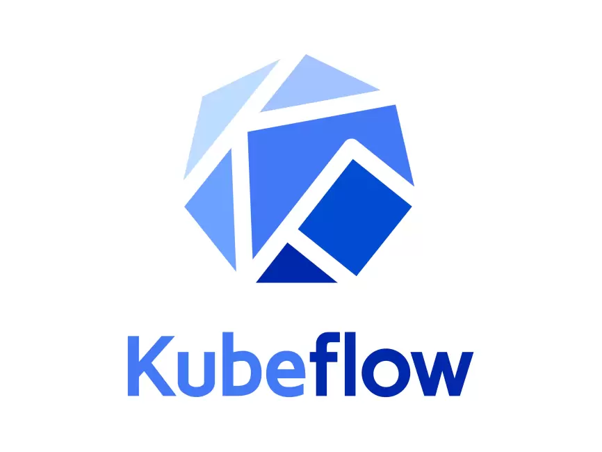

# ML Engineering for Production <br> (DSAI 406)
## Lecture {{$slidev.configs.lecture}}

Mohamed Ghalwash
<Email v="mghalwash@zewailcity.edu.eg" />

---
layout: fact
---

# Recording is NOT allowed

---
layout: section 
---

# Scaling the Research Lifecycle 

<hr/> 

#### Transitioning from Kubernetes to Kubeflow


---
layout: top-title
---

:: title :: 

# Why K8s Isn't Enough for ML?

:: content :: 

Standard Kubernetes is **Infrastructure-Centric**, but AI is **Process-Centric**

- **Manual Versioning**
  
  Managing tags for `personacanvas-backend:v1...v50` manually is a logistical burden

- **Fragmented Workflow**
  
  Data cleaning, training, and serving are disconnected YAML files

- **Resource Inefficiency**
  
  Static requests/limits don't account for the "bursty" nature of training

- **The Goal**
  
  Move from managing Containers to managing Pipelines

---
layout: top-title-two-cols
image: 
---

:: title :: 
# Kubeflow: The Cloud-Native ML Platform

:: right :: 

Kubeflow sits on top of Kubernetes to provide a specialized "Factory" for AI.

- **Notebooks:** Jupyter/VS Code environments running as scalable Pods.
- **Pipelines:** Multi-step workflows (Data → Train → Deploy) that are repeatable.
- **Katib:** Automated hyperparameter tuning (AutoML).
- **KServe:** Advanced model serving with "Scale-to-Zero" to save GPU costs.

:: left :: 



---
layout: top-title
---

:: title :: 

# The Architectural Shift: From Static YAML to Dynamic Workflows

:: content :: 

| Feature | Standard K8s (Current) | Kubeflow (Next Step) |
| :--- | :--- | :--- |
| **Unit of Work** | The Pod / Deployment | The Pipeline Step |
| **Interface** | CLI (`kubectl`) | Kubeflow Dashboard / SDK |
| **Training** | Manual `kubectl apply` | Scheduled Experiments |
| **GPU Mgmt** | Hard-coded in YAML | Dynamic allocation |

---
layout: center
class: text-center
---

# Ready to explore Kubeflow Pipelines?

<!-- 
- `kubectl get node` to get all nodes in the cluster 
- `kubectl create deployment` deploy an app on the cluster (stateless app. for stateful use StateFulSet instead of deployment)
  - e.g. `kubectl create deployment my-app --image=gcr.io/google-samples/kubernetes-bootcamp:v1 --replicas=2`
    - searched for a suitable node where an instance of the application could be run
    - scheduled the application to run on that Node
    - configured the cluster to reschedule the instance on a new Node when needed
  - The instance is running inside a container on your node
- Proxy or Service 
  - `kubectl proxy` to have a connection between the host (the terminal) and the Kubernetes cluster on port 8001
    ```
    export POD_NAME="$(kubectl get pods -o go-template --template '{{range .items}}{{.metadata.name}}{{"\n"}}{{end}}')"
    echo Name of the Pod: $POD_NAME
    ```
    - `kubectl get pods` to get all pods 
    - `kubectl describe pods` to get the Pod’s container information such as IP address and the ports
    - `kubectl exec -ti $POD_NAME -- bash` to open console on the container where we run our application
    - `http://localhost:8001/api/v1/namespaces/default/pods/$POD_NAME:8080/proxy/`
  - Service: 
    - `kubectl get services`
    - `kubectl expose deployment/my-app --type="NodePort" --port 8080` We have now a running Service called kubernetes-bootcamp
    - `kubectl describe services/my-app` to get the port 
    - 
    ```
    export NODE_PORT="$(kubectl get services/kubernetes-bootcamp -o go-template='{{(index .spec.ports 0).nodePort}}')"
    echo "NODE_PORT=$NODE_PORT"
    ```
    - `curl http://"$(minikube ip):$NODE_PORT"`

    - `kubectl describe deployment` see the name (the key) of the label for our Pod
    - `kubectl get pods -l app=kubernetes-bootcamp` to get the list of Pods
    - `kubectl get services -l app=kubernetes-bootcamp` to get the list of Services 
    - 
    ```
    export POD_NAME="$(kubectl get pods -o go-template --template '{{range .items}}{{.metadata.name}}{{"\n"}}{{end}}')"
    echo "Name of the Pod: $POD_NAME"
    ``` 
-->

---
layout: top-title 
---

:: title :: 

# GHA: Strengths and Operational Limits

:: content :: 

* **Primary Goal:** Code Integrity (Building, Testing, Pushing Images).
* **Trigger:** Git Events (Push, Pull Request).
* **The "Midterm" Workflow:**
  * Build a Docker Image.
  * Push to Registry.
  * Small scale training (<10GB) on a single Runner.

> **The Operational Wall:** GHA treats every job as an isolated "Clean Slate." It is a **Job Runner**, not a **Resource Scheduler**.

---
layout: top-title 
---

:: title :: 

# Why we are moving to Kubeflow

:: content :: 


We have seen that:
1. **GHA Isolation:** Each job is a separate VM. (No easy data sharing).
2. **Docker Volumes:** Local to the VM. (If Job B starts on a *new* VM, the Volume is gone).

> How do we get **Job B** to see the **Volume** created by **Job A** if they are on different physical machines?

<!-- **The Answer:** **Persistent Volume Claims (PVC)** and **Networked Storage** in Kubeflow. -->

---
layout: top-title 
---

:: title :: 

# The Shift: From CI/CD to Orchestration

:: content :: 

| Feature | **GitHub Actions (CI/CD)** | **Kubeflow (ML Orchestrator)** |
| :--- | :--- | :--- |
| **Primary Goal** | Building & Testing | Managing the ML Factory |
| **Infrastructure** |  General Cloud VMs |  Inside the K8s Cluster |
| **Resource Logic** |  Assigns a whole VM |  Fine-grained Bin-Packing |
| **Scaling** |  Isolated VMs |  Multi-Node Training  |
| **Data Handling** |  Upload/Download |  Mounts Persistent Volumes (PV) |
| **State & Failure** |  Restarts from Step 1 | Step-Level Caching |
| **The "Wall"** | Network Latency (Slow) | Shared Storage (Instant) |


---
layout: section
---

# Scenario 1: The "Data Tax" Mystery
<hr>

### Moving 500GB of Protein Sequences

---
layout: top-title-two-cols
---

:: title :: 

# Data Sharing 

:: left :: 

# GHA 

In GHA, Job A and Job B are on different VMs. Data must be physically moved.

```yaml
# github-action.yaml
jobs:
  preprocess:
    runs-on: ubuntu-latest
    steps:
      - run: python clean.py --out data.zip
      - uses: actions/upload-artifact@v4
        with:
          path: data.zip # The "Tax" (Upload)

  train:
    needs: preprocess
    runs-on: ubuntu-latest-8-core
    steps:
      - uses: actions/download-artifact@v4 # The "Tax" (Download)
      - run: python train.py
```
:: right :: 

# Kubeflow 

In Kubeflow, the data stays on the disk. The containers come to the data.

```yaml 
# kubeflow-dag.yaml
components:
  - name: preprocess
    container:
      image: my-cleaner:v1
      outputs: [data_path]
  - name: train
    container:
      image: my-trainer:v1
      inputs: [data_path]
```

- Task B mounts the SAME Persistent Volume (PV) Task A just wrote to
- Zero Network Egress Cost

---
layout: section
---

# Scenario 2: The "OOM" & Resource Deadlock
<hr> 

### High RAM vs. GPU Training
<br>
<br>

You have one physical worker node with **64GB RAM** and **1 GPU**

<br>

1. **Researcher A** starts a "Data Prep" job (Needs 60GB RAM, 0 GPU)
2. **Researcher B** starts a "Training" job (Needs 8GB RAM, 1 GPU)

---
layout: top-title-two-cols
---

:: title :: 

# Resource Sharing 

:: left :: 

GHA is a **Job Runner**, not a **Resource Scheduler**. It assumes the runner can handle the job if it's "Idle."

```yaml
# github-action.yaml
jobs:
  researcher_a:
    runs-on: [self-hosted, gpu-node]
    steps:
      - run: python heavy_prep.py # Uses 60GB

  researcher_b:
    runs-on: [self-hosted, gpu-node]
    steps:
      - run: python train.py # Uses 8GB
```

**Outcome**: The OS kills Job A because Job B pushed total RAM to **68GB**.

**System Crash (OOM)**.

:: right :: 

Kubeflow is Resource-Aware. It treats your cluster as a pool of Memory/CPU/GPU.

```yaml
# kubeflow-dag.yaml
- name: heavy-prep
  container:
    resources:
      requests:
        memory: "60Gi"
- name: train
  container:
    resources:
      requests:
        memory: "8Gi"
        [nvidia.com/gpu](https://nvidia.com/gpu): 1
```

Kubeflow puts Job B in "PENDING" state until Job A  releases the 60GB

---
layout: section
---

# Scenario 3: The "Resume" Logic
<hr>

### Why pay for the same work twice?

<br>

Your Training container (Step 3 of 5) crashes at **Hour 4** because the Cloud Provider reclaimed the Spot Instance

---
layout: top-title-two-cols
---

:: title :: 

# Caching Problem

:: left :: 

GHA is "all or nothing" per Job.

```yaml
# github-action.yaml
jobs:
  train:
    runs-on: ubuntu-latest
    strategy:
      # Only retries the WHOLE job
      max-parallel: 1 
    steps:
      - name: Fetch Data
        run: python get_data.py # 1 hr
      - name: Train
        run: python train.py # 4 hrs
```

If `train.py` fails, GHA restarts the Job. You lose the 1-hour "Fetch Data" work every time.

:: right ::

Kubeflow treats every node as a **Stateful Entry**.

```yaml
# kubeflow-dag.yaml
- name: fetch-data
  container:
    image: fetcher:v1
  # DEFAULT: Enable Caching
  metadata:
    annotations:
      pipelines.kubeflow.org/cache_enabled: "true"

- name: train
  container:
    image: trainer:v1
  # If Train fails, it ONLY 
  # restarts the Train node.
```

Kubeflow sees the `fetch-data` output in the Metadata Store. It **skips** the 1-hour fetch and goes straight to training.

---
layout: top-title 
---
:: title :: 

# Summary: When to move to Kubeflow?

:: content :: 

* **Caching:** When re-running early steps (Data Prep) is expensive or slow.
* **Data Locality:** When data is too large (>50GB) to "Upload/Download" between VMs.
* **Communication:** When you need **Distributed Training** (Runners talking to each other via NCCL/MPI).
* **Bin-Packing:** When you need to request specific CPUs/GPUs/RAM to ensure 100% hardware utilization.

---
layout: center
title: References
---
References: 

- Chip Huyen, *Designing ML Systems*, Chapter 10.3

- [Nice Tutorial for Kubernetes](https://www.youtube.com/watch?v=s_o8dwzRlu4&t=104s)

- [How to remotely SSH (connect) Visual Studio Code to AWS EC2](https://www.youtube.com/watch?v=sQQjMnEkGjs&t=1s)


---
layout: top-title
---

:: title :: 

# TensorBoard: The Micro-Manager
### Zooming into the Training Loop

:: content :: 

While MLflow looks at the End Result, TensorBoard looks at the Process.

- **Real-time**: Watch the loss curve live. If it goes to NaN, kill the job.

- **Histograms**: View weight distributions to see if your gradients are "vanishing."

- **Embedding Projector**: Visualize high-dimensional data (like Word2Vec) in 3D.

```python 
from torch.utils.tensorboard import SummaryWriter

writer = SummaryWriter('logs/run_1')

for epoch in range(100):
    loss = train_step()
    # Log scalars to plot a curve
    writer.add_scalar('Loss/train', loss, epoch)
    
    # Log images to see what the model "sees"
    writer.add_image('prediction_sample', img_grid, epoch)

writer.close()
```

---
layout: top-title
---

:: title :: 

# Docker Compose: The Conductor
### Running your whole "Lab" at once

:: content :: 

Your ML project now has multiple moving parts:

- The Trainer (Your PyTorch code).
- The MLflow Server (To view results).
- The TensorBoard UI.

Instead of 3 terminal windows, we use Docker Compose to orchestrate them in one command.

---
layout: top-title
---

:: title :: 

# Git: The Source of Truth
### If it isn't in Git, it didn't happen.

:: content :: 

In MLOps, Git tracks the **Logic** (Code, Dockerfiles, Configs), but **never** the heavy lifting.

* ✅ **Track these:** `.py` scripts, `Dockerfile`, `requirements.txt`, `.github/workflows/`.
* ❌ **Ignore these:** `.pkl` models, `.csv` data, `venv/` folders, `.log` files.

<div class="grid grid-cols-2 gap-4 mt-6">
  <div class="bg-gray-800 p-4 rounded shadow">
    <h4 class="text-green-400 font-mono">.gitignore</h4>
    <pre class="text-xs">
data/
models/
__pycache__/
.env
.DS_Store</pre>
  </div>
  <div class="flex flex-col justify-center">
    <p class="text-sm">
      <b>The Rule:</b> If a file is >50MB or changes every time you run a script (like a log), it belongs in <b>DVC</b> or an <b>Artifact Store</b>, not Git.
    </p>
  </div>
</div>

---
layout: cover
---

# Docker Storage

---
layout: two-cols
---

:: left :: 

# 1. Bind Mounts
**Host-Dependent.**
Maps a folder on your laptop/VM directly into the container.

* **Use Case:** Local development.
* **MLOps Risk:** If the folder path `/home/mohamed/data` doesn't exist on the Runner, the container crashes.

```bash
# Mounting a local folder
docker run -v /host/path:/container/path my-image
```

:: right   ::

# 2. Volumes
**Docker-Managed.**
Docker creates a managed space on the disk.

* **Use Case:** Production & DVC Caching.
* **Integrating with DVC:** * We use volumes to cache the `.dvc/cache`.
  * This prevents re-downloading 10GB of data every time the container restarts.
* **The Limit:** Volumes are local to the VM.
